#linux内存及相关函数 
===
<link rel="stylesheet" href="http://yandex.st/highlightjs/6.2/styles/googlecode.min.css">
 
<script src="http://code.jquery.com/jquery-1.7.2.min.js"></script>
<script src="http://yandex.st/highlightjs/6.2/highlight.min.js"></script>
 
<script>hljs.initHighlightingOnLoad();</script>
<script type="text/javascript">
 $(document).ready(function(){
      $("h2,h3,h4,h5,h6").each(function(i,item){
        var tag = $(item).get(0).localName;
        $(item).attr("id","wow"+i);
        $("#category").append('<a class="new'+tag+'" href="#wow'+i+'">'+$(this).text()+'</a></br>');
        $(".newh2").css("margin-left",0);
        $(".newh3").css("margin-left",20);
        $(".newh4").css("margin-left",40);
        $(".newh5").css("margin-left",60);
        $(".newh6").css("margin-left",80);
      });
 });
</script>
<div id="category"></div>


##目录
[1.进程分配的两种方式](#1)

[2.brk,sbrk函数使用方法解析](#2)

[3.brk,sbrk定义](3)

[4.linux内存使用方法](4)

[5.进程内存分布](5)

[6.C风格的内存分配程序](#6)

+ [6.1实现一个简单的分配程序](#6.1)
+ [6.2半自动内存管理策略](#6.2)
+ [6.3垃圾收集](#6.3)
+ [6.4结束语](#6.4)

[7.tcmalloc](#7)


====

##1.进程分配的两种方式brk和nnmap
###1.1如何查看进程发生缺页中断次数？
	ps -o majflt,minflt -C program命令查看。
	majflt代表major fault，中文名叫大错误，minflt代表minor fault，中文名叫小错误。
	这两个数值表示一个进程自启动以来所发生的缺页中断的次数。
###2.1发生缺页次数后，执行了哪些操作？
	当一个进程发生缺页后，进程会陷入内核态，执行：
	1. 检查要访问的地址是否合法
	2. 查找/分配一个物理页
	3、填充物理页内容（读取磁盘，或者直接置0，或者啥也不干）
	4. 建立映射关系（虚拟地址到物理地址）
	重新执行发生缺页的中断的那条指令，如果如果第3步，需要读取磁盘，那么这次缺页中断就是majflt，否则就是minflt。

##2.内存分配原理
从操作系统角度来看，进程分配内存有两种方式，分别由两个系统调用完成：**brk**和**mmap**（不考虑共享内存）。   
###1.brk是将数据段(.data)的最高地址指针_edata往高地址推;  
###2.mmap是在进程的虚拟地址空间中（堆和栈中间，称为文件映射区域的地方）找一块空闲的虚拟内存。
这两种方式分配的都是**虚拟内存**，没有分配物理内存。在第一次访问已分配的虚拟地址空间的时候，发生缺页中断，操作系统负责分配物理内存，然后建立虚拟内存和物理内存之间的映射关系。

在标准C库中，提供了malloc/free函数分配释放内存，这两个函数底层是由brk，mmap，munmap这些系统调用实现的。	


下面以一个例子来说明内存分配的原理：		
####情况一、malloc小于128k的内存，使用brk分配内存，将_edata往高地址推(只分配虚拟空间，不对应物理内存(因此没有初始化)，第一次读/写数据时，引起内核缺页中断，内核才分配对应的物理内存，然后虚拟地址空间建立映射关系)，如下图:


###1.进程启动的时候，其（虚拟）内存空间的初始布局如图1所示。  
其中，mmap内存映射文件是在堆和栈的中间（例如libc-2.2.93.so，其它数据文件等），为了简单起见，省略了内存映射文件.  
	\_edata指针（glibc里面定义）指向数据段的最高地址。  
###2.进程调用A=malloc(30K)以后，内存空间如图2：  
malloc函数会调用brk系统调用，将\_edata指针往高地址推30K，就完成虚拟内存分配。你可能会问：只要把\_edata+30K就完成内存分配了？  
事实是这样的，_edata+30K只是完成虚拟地址的分配，A这块内存现在还是没有物理页与之对应的，等到进程第一次读写A这块内存的时候，发生缺页中断，这个时候，内核才分配A这块内存对应的物理页。也就是说，如果用malloc分配了A这块内容，然后从来不访问它，那么，A对应的物理页是不会被分配的。  
###3.进程调用B=malloc(40K)以后，内存空间如图3。

####情况二、malloc大于128k的内存，使用mmap分配内存，在堆和栈之间找一块空闲内存分配(对应独立内存，而且初始化为0)，如下图：
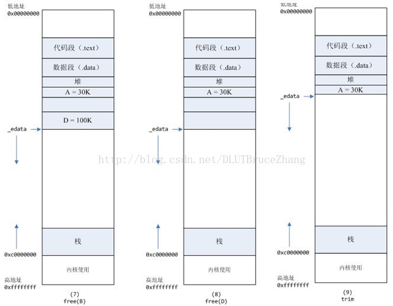

###4.进程调用C=malloc(200K)以后，内存空间如图4：  
   默认情况下，malloc函数分配内存，如果请求内存大于128K（可由M_MMAP_THRESHOLD选项调节），那就不是去推_edata指针了，而是利用mmap系统调用，从堆和栈的中间分配一块虚拟内存。  
这样子做主要是因为:  
brk分配的内存需要等到高地址内存释放以后才能释放（例如，在B释放之前，A是不可能释放的，这就是内存碎片产生的原因，什么时候紧缩看下面），而mmap分配的内存可以单独释放。  
当然，还有其它的好处，也有坏处，再具体下去，有兴趣的同学可以去看glibc里面malloc的代码了。   
####5、进程调用D=malloc(100K)以后，内存空间如图5；  
####6、进程调用free(C)以后，C对应的虚拟内存和物理内存一起释放。


####7、进程调用free(B)以后，如图7所示：  
B对应的虚拟内存和物理内存都没有释放，因为只有一个_edata指针，如果往回推，那么D这块内存怎么办呢？
当然，B这块内存，是可以重用的，如果这个时候再来一个40K的请求，那么malloc很可能就把B这块内存返回回去了。   
####8、进程调用free(D)以后，如图8所示：  
B和D连接起来，变成一块140K的空闲内存。  
####9、默认情况下：  
当最高地址空间的空闲内存超过128K（可由M_TRIM_THRESHOLD选项调节）时，执行内存紧缩操作（trim）。在上一个步骤free的时候，发现最高地址空闲内存超过128K，于是内存紧缩，变成图9所示。
在了解了内存分配原理以后来看一个现象:

	1.压力测试过程中，发现被测对象性能不够理想，具体表现为：
	进程的系统态CPU消耗20，用户态CPU消耗10，系统idle大约70  
	2.用ps -o majflt,minflt -C program命令查看，发现majflt每秒增量为0，而minflt每秒增量大于10000。  

初步分析

	majflt代表major fault，中文名叫大错误，minflt代表minor fault，中文名叫小错误。  
	这两个数值表示一个进程自启动以来所发生的缺页中断的次数。  
	当一个进程发生缺页中断的时候，进程会陷入内核态，执行以下操作：  
	检查要访问的虚拟地址是否合法  
	查找/分配一个物理页
	填充物理页内容(读取磁盘，或者直接置0，或者啥也不干)  
	建立映射关系(虚拟地址到物理地址)  
	重新执行发生缺页中断的那条指令  
	如果第3步，需要读取磁盘，那么这次缺页中断就是majflt，否则就是minflt。  
	此进程minflt如此之高，一秒10000多次，不得不怀疑它跟进程内核态cpu消耗大有很大关系。  
分析代码  
	
	查看代码，发现是这么写的：一个请求来，用malloc分配2M内存，请求结束后free这块内存。看日志，发现分配内存语句耗时10us，平均一条请求处理耗时1000us 。 原因已找到!  
	虽然分配内存语句的耗时在一条处理请求中耗时比重不大，但是这条语句严重影响了性能。要解释清楚原因，需要先了解一下内存分配的原理。
真相大白  

	说完内存分配的原理，那么被测模块在内核态cpu消耗高的原因就很清楚了：每次请求来都malloc一块2M的内存，默认情况下，malloc调用mmap分配内存，请求结束的时候，调用munmap释放内存。假设每个请求需要6个物理页，那么每个请求就会产生6个缺页中断，在2000的压力下，每秒就产生了10000多次缺页中断，这些缺页中断不需要读取磁盘解决，所以叫做minflt;缺页中断在内核态执行，因此进程的内核态cpu消耗很大。缺页中断分散在整个请求的处理过程中，所以表现为分配语句耗时(10us)相对于整条请求的处理时间(1000us)比重很小。  
解决办法  
	
	将动态内存改为静态分配，或者启动的时候，用malloc为每个线程分配，然后保存在threaddata里面。但是，由于这个模块的特殊性，静态分配，或者启动时候分配都不可行。另外，Linux下默认栈的大小限制是10M，如果在栈上分配几M的内存，有风险。  
	禁止malloc调用mmap分配内存，禁止内存紧缩。  
	在进程启动时候，加入以下两行代码：  
	mallopt(M_MMAP_MAX, 0); // 禁止malloc调用mmap分配内存       
  	mallopt(M_TRIM_THRESHOLD, -1); // 禁止内存紧缩  
	效果：加入这两行代码以后，用ps命令观察，压力稳定以后，majlt和minflt都为0。进程的系统态cpu从20降到10。  
小结  
	
	可以用命令ps -o majflt minflt -C program来查看进程的majflt, minflt的值，这两个值都是累加值，从进程启动开始累加。在对高性能要求的程序做压力测试的时候，我们可以多关注一下这两个值。
	如果一个进程使用了mmap将很大的数据文件映射到进程的虚拟地址空间，我们需要重点关注majflt的值，因为相比minflt，majflt对于性能的损害是致命的，随机读一次磁盘的耗时数量级在几个毫秒，而minflt只有在大量的时候才会对性能产生影响。

#二.brk() , sbrk() 使用方法解析

brk() , sbrk() 的声明如下：

```
#include <unistd.h>  
int brk(void *addr);  
void *sbrk(intptr_t increment);  
```
首先说明一点 **sbrk()是函数库调用**，**brk()是系统调用**,这两个函数都用来改变 "program break" (程序间断点)的位置，这个位置可参考下图：
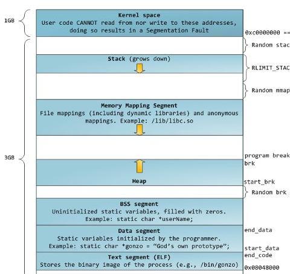

如 man 里说的：
>
brk()  and  sbrk() change the location of the program break, which defines the end of the process's data segment (i.e., the program break is the first location after the end of the uninitialized data segment). 

>brk() 和 sbrk() 改变 "program brek" 的位置，这个位置定义了进程数据段的终止处(也就是说，program break 是在未初始化数据段终止处后的第一个位置)。
如此翻译过来，似乎会让人认为这个 program break 是和上图中矛盾的，上图中的 program break 是在堆的增长方向的第一个位置处(堆和栈的增长方向是相对的)，而按照说明手册来理解，似乎是在 bss segment 结束那里(因为未初始化数据段一般认为是 bss segment)。

首先说明一点，一个程序一旦编译好后，text segment ，data segment 和 bss segment 是确定下来的，这也可以通过 objdump 观察到。下面通过一个程序来测试这个 program break 是不是在 bss segment 结束那里：

```
#include <stdio.h>  
#include <unistd.h>  
#include <stdlib.h>  
#include <sys/time.h>  
#include <sys/resource.h>  
   
    
 int bssvar;    //声明一个味定义的变量，它会放在 bss segment 中  
    
    
 int main(void)  
 {  
     char *pmem;  
     long heap_gap_bss;  
    
    
     printf ("end of bss section:%p\n", (long)&bssvar + 4);  
    
    
     pmem = (char *)malloc(32);          //从堆中分配一块内存区，一般从堆的开始处获取  
     if (pmem == NULL) {  
         perror("malloc");  
         exit (EXIT_FAILURE);  
     }  
    
    
     printf ("pmem:%p\n", pmem);  
    
    
 //计算堆的开始地址和 bss segment 结束处得空隙大小，注意每次加载程序时这个空隙都是变化的，但是在同一次加载中它不会改变  
     heap_gap_bss = (long)pmem - (long)&bssvar - 4;            
     printf ("1-gap between heap and bss:%lu\n", heap_gap_bss);  
    
    
     free (pmem);   //释放内存，归还给堆  
        
     sbrk(32);        //调整 program break 位置(假设现在不知道这个位置在堆头还是堆尾)  
      pmem = (char *)malloc(32);   //再一次获取内存区  
         if (pmem == NULL) {  
                 perror("malloc");  
                 exit (EXIT_FAILURE);  
         }  
    
    
         printf ("pmem:%p\n", pmem);   //检查和第一次获取的内存区的起始地址是否一样  
     heap_gap_bss = (long)pmem - (long)&bssvar - 4;  //计算调整 program break 后的空隙  
     printf ("2-gap between heap and bss:%lu\n", heap_gap_bss);  
    
    
     free(pmem);   //释放  
     return 0;  
}  
```
下面，我们分别运行两次程序，并查看其输出：

	[beyes@localhost C]$ ./sbrk 
	end of bss section:0x8049938
	pmem:0x82ec008
	1-gap between heap and bss:2762448
	pmem:0x82ec008
	2-gap between heap and bss:2762448
	[beyes@localhost C]$ ./sbrk 
	end of bss section:0x8049938
	pmem:0x8dbc008
	1-gap between heap and bss:14100176
	pmem:0x8dbc008
	2-gap between heap and bss:14100176


从上面的输出中，可以发现几点：

1. bss 段一旦在在程序编译好后，它的地址就已经规定下来。

2. 一般及简单的情况下，使用 malloc() 申请的内存，释放后，仍然归还回原处，再次申请同样大小的内存区时，还是从第 1 次那里获得。
3. bss segment 结束处和堆的开始处的空隙大小，并不因为 sbrk() 的调整而改变，也就是说明了 program break 不是调整堆头部。

所以，man 手册里所说的  “program break 是在未初始化数据段终止处后的第一个位置” ，不能将这个位置理解为堆头部。这时，可以猜想应该是在堆尾部，也就是堆增长方向的最前方。下面用程序进行检验：

当 sbrk() 中的参数为 0 时，我们可以找到 program break 的位置。那么根据这一点，检查一下每次在程序加载时，系统给堆的分配是不是等同大小的：


```
 #include <stdio.h>  
 #include <unistd.h>  
 #include <stdlib.h>  
 #include <sys/time.h>  
 #include <sys/resource.h>     
 int main(void)  
 {  
         void *tret;  
         char *pmem;  
    
         pmem = (char *)malloc(32);  
         if (pmem == NULL) {  
                 perror("malloc");  
                 exit (EXIT_FAILURE);  
         }      
         printf ("pmem:%p\n", pmem);  
    
         tret = sbrk(0);  
         if (tret != (void *)-1)  
                 printf ("heap size on each load: %lu\n", (long)tret - (long)pmem);  
       
     return 0;  
 }  

```
运行上面的程序 3 次：

	[beyes@localhost C]$ ./sbrk 
	pmem:0x80c9008
	heap size on each load: 135160
	[beyes@localhost C]$ ./sbrk 
	pmem:0x9682008
	heap size on each load: 135160
	[beyes@localhost C]$ ./sbrk 
	pmem:0x9a7d008
	heap size on each load: 135160
	[beyes@localhost C]$ ./sbrk 
	pmem:0x8d92008
	heap size on each load: 135160
	[beyes@localhost C]$ vi sbrk.c
从输出可以看到，虽然堆的头部地址在每次程序加载后都不一样，但是每次加载后，堆的大小默认分配是一致的。但是这不是不能改的，可以使用 sysctl 命令修改一下内核参数：

	sysctl -w kernel/randomize_va_space=0

这么做之后，再运行 3 次这个程序看看：

	[beyes@localhost C]$ ./sbrk 
	pmem:0x804a008
	heap size on each load: 135160
	[beyes@localhost C]$ ./sbrk 
	pmem:0x804a008
	heap size on each load: 135160
	[beyes@localhost C]$ ./sbrk 
	pmem:0x804a008
	heap size on each load: 135160
从输出看到，每次加载后，堆头部的其实地址都一样了。但我们不需要这么做，每次堆都一样，容易带来缓冲区溢出攻击(以前老的 linux 内核就是特定地址加载的)，所以还是需要保持 randomize_va_space 这个内核变量值为 1 。
下面就来验证 sbrk() 改变的 program break 位置在堆的增长方向处：

```
 #include <stdio.h>  
 #include <unistd.h>  
 #include <stdlib.h>  
 #include <sys/time.h>  
 #include <sys/resource.h>  
    
    
 int main(void)  
 {  
         void *tret;  
         char *pmem;  
         int i;  
         long sbrkret;  
    
        pmem = (char *)malloc(32);  
         if (pmem == NULL) {  
                 perror("malloc");  
                 exit (EXIT_FAILURE);  
         }  
    
    
         printf ("pmem:%p\n", pmem);  
    
          for (i = 0; i < 65; i++) {  
                 sbrk(1);  
                 printf ("%d\n", sbrk(0) - (long)pmem - 0x20ff8);   //0x20ff8 是堆开始到堆结束的位置，就是堆和 bss段 之间的空隙常数；改变后要用 sbrk(0) 再次获取更新后的program break位置  
         }  
        free(pmem);  
    
           
        return 0;  
 }  
```
运行输出：

	[beyes@localhost C]$ ./sbrk 
	pmem:0x804a008
	1
	2
	3
	4
	5
	... ...
	61
	62
	63
	64

从输出看到，sbrk(1) 每次让堆往栈的方向增加 1 个字节的大小空间。  
而 brk() 这个函数的参数是一个地址，假如你已经知道了堆的起始地址，还有堆的大小，那么你就可以据此修改 brk() 中的地址参数已达到调整堆的目的。  
实际上，在应用程序中，基本不直接使用这两个函数，取而代之的是 malloc() 一类函数，这一类库函数的执行效率会更高。还需要注意一点，当使用 malloc() 分配过大的空间，比如超出 0x20ff8 这个常数(在我的系统(Fedora15)上是这样，别的系统可能会有变)时，malloc 不再从堆中分配空间，而是使用 mmap() 这个系统调用从映射区寻找可用的内存空间。

===

#malloc(), vmalloc()和 kmalloc()区别
在内核空间上也有分配内存的系统调用kmalloc() vmalloc()

	kmalloc和vmalloc是分配的是内核的内存,malloc分配的是用户的内存
	kmalloc保证分配的内存在物理上是连续的,vmalloc保证的是在虚拟地址空间上的连续
	kmalloc能分配的大小有限,vmalloc和malloc能分配的大小相对较大
	内存只有在要被DMA访问的时候才需要物理上连续
	vmalloc比kmalloc要慢

===
#三.brk和sbrk的定义
在man手册中定义了这两个函数：
``` 

	#include <unistd.h>
	int brk(void *addr);
	void *sbrk(intptr_t increment);


手册上说brk和sbrk会改变program break的位置，program break被定义为程序data segment的结束位置。感觉这句话不是很好理解，从下面程序地址空间的分布来看，data segment后面还有bss segment，显然和手册说的不太一样。一种可能的解释就是手册中的data segment和下图中的data segment不是一个意思，手册中的data segment应该包含了下图中的data segment、bss segment和heap，所以program break指的就是下图中heap的结束地址。


有了前面program break的概念后，我们来看下brk和sbrk的作用。brk通过传递的addr来重新设置program break，成功则返回0，否则返回-1。而sbrk用来增加heap，增加的大小通过参数increment决定，返回增加大小前的heap的program break，如果increment为0则返回program break。
从上面的图可以看出heap的起始地址并不是bss segment的结束地址，而是随机分配的，下面我们用一个程序来验证下：


```
	#include <stdio.h>
	#include <unistd.h> 

	int bss_end;
	int main(void)
	{

	     void *tret;       
	     printf("bss end: %p\n", (char *)(&bss_end) + 4);
	     tret = sbrk(0);
	     if (tret != (void *)-1)
	         printf ("heap start: %p\n", tret);
	     return 0;
	 }

```
运行的结果为：


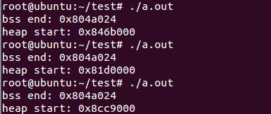


从上面运行结果可以知道bss和heap是不相邻的，并且同一个程序bss的结束地址是固定的，而heap的起始地址在每次运行的时候都会改变。你可能会说sbkr(0)返回的是heap的结束地址，怎么上面确把它当做起始地址呢？由于程序开始运行时heap的大小是为0，所以起始地址和结束地址是一样的，不信我们可以用下面的程序验证下。

```
1 #include <stdio.h>
 2 #include <unistd.h>
 3 #include <stdlib.h>
 4  
 5 int bss_end;
 6 
 7 int main(void)
 8 {
 9     void *tret;
10     char *pmem;
11         
12     printf("bss end: %p\n", (char *)(&bss_end) + 4);
13     tret = sbrk(0);
14     if (tret != (void *)-1)
15         printf ("heap1 start: %p\n", tret);
16     
17     if (brk((char *)tret - 1) == -1)
18         printf("brk error\n");
19         
20     tret = sbrk(0);
21     if (tret != (void *)-1)
22         printf ("heap2 start: %p\n", tret);
23     
24     pmem = (char *)malloc(32);
25     if (pmem == NULL) {
26         perror("malloc");
27         exit (EXIT_FAILURE);
28     }
29     printf ("pmem:%p\n", pmem);
30     
31     tret = sbrk(0);
32     if (tret != (void *)-1)
33         printf ("heap1 end: %p\n", tret);
34     
35     if (brk((char *)tret - 10) == -1)
36         printf("brk error\n");
37         
38     tret = sbrk(0);
39     if (tret != (void *)-1)
40         printf ("heap2 end: %p\n", tret);
41     return 0;
42 }

```
运行结果为：

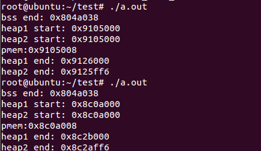


程序开始的时候打印出来heap的结束地址，并用这个地址减1来重新设置heap的结束地址，结果两次的结束地址居然是一样的，那说明这个结束地址就是heap的起始地址，再减小这个起始地址是不允许的，不过brk也不会报错。然后调用malloc获取内存，并打印出该内存的起始地址pmem，可以发现pmem与heap的起始地址相差8个字节，为什么会有8个字节没有？这8个字节应该是用来管理heap空间的（不深究）。最后再次获得heap的结束地址，并用这个地址减10来重新设置heap的结束地址，这下地址设置成功了。

##堆的管理
上面的函数我们其实很少使用，大部分我们使用的是malloc和free函数来分配和释放内存。这样能够提高程序的性能，不是每次分配内存都调用brk或sbrk，而是重用前面空闲的内存空间。brk和sbrk分配的堆空间类似于缓冲池，每次malloc从缓冲池获得内存，如果缓冲池不够了，再调用brk或sbrk扩充缓冲池，直到达到缓冲池大小的上限，free则将应用程序使用的内存空间归还给缓冲池。
如果缓冲池需要扩充时，一次扩充多少呢？先运行下面的程序看看：

```
 1 #include <stdio.h>
 2 #include <unistd.h>
 3 #include <stdlib.h>
 4  
 5 int main(void)
 6 {
 7         void *tret;
 8         char *pmem;
 9         
10         tret = sbrk(0);
11         if (tret != (void *)-1)
12                 printf ("heap start: %p\n", tret);
13                 
14         pmem = (char *)malloc(64);  //分配内存
15         if (pmem == NULL) {
16                 perror("malloc");
17                 exit (EXIT_FAILURE);
18         }
19         printf ("pmem:%p\n", pmem);
20         tret = sbrk(0);
21         if (tret != (void *)-1)
22                 printf ("heap size on each load: %p\n", (char *)tret - pmem);
23     free(pmem)
24     return 0;
25 }

```

运行结果如下：

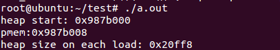

从结果可以看出调用malloc(64)后缓冲池大小从0变成了0x20ff8，将上面的malloc(64)改成malloc(1)结果也是一样，只要malloc分配的内存数量不超过0x20ff8，缓冲池都是默认扩充0x20ff8大小。

**值得注意的是如果malloc一次分配的内存超过了0x20ff8，malloc不再从堆中分配空间，而是使用mmap()这个系统调用从映射区寻找可用的内存空间。**

接下来就是要对用brk和mmap分配好内存进行管理了。因为brk()，mmap()是系统调用，如果每次调用malloc动态分配内存都执行一次系统调用，那开销是比较大的。再者，如果每次申请的内存较小，但是系统分配的内存都是固定大小的倍数(一般是4KB,一页)，这样就会有大量的浪费。所以malloc一般会实现一个内存堆来管理这些内存,malloc分配的内存都会以若干chunk的方式放到内存堆中。每次用户调用malloc动态分配内存的时候，malloc会先到内存堆里进行查找，如果内存堆里没有合适的空闲chunk，再利用brk/malloc系统调用分配一大块内存，然后把新分配的大块内存放到内存堆中，并生成一块合适的chunk块返回给用户。当用户用free释放chunk的时候，可能并不立即使用系统调用释放内存，而是将释放的chunk作为空闲chunk加入内存堆中，和其他的空闲chunk合并，便于下次分配的时候再次使用。
    
一般说来，释放的chunk如果标记为mmap申请的，则使用munmap释放。如果是brk申请的，进一步判断堆顶之下的空闲chunk是否大于128KB，如果是，则使用brk()释放。如果小于128KB，仍由内存堆维护。这样对brk()的使用就会有个问题，当brk()释放的内存块在堆顶之下，且内存块到堆顶之间还有未释放的内存。那么这块内存的释放将不会成功，从而形成内存空洞。

```
1. 无论是堆，还是栈都是对虚存的操作和管理。 
2. 系统调用brk()和mmap()用来动态分配虚存空间，也就是表明这些虚存地址是合法的，访问的时候，系统应为其分配物理内存，而不是报错。 
3. 堆的本质是动态申请的虚存空间。理论上可以用任何方式去管理这块空间。但数据结构--"堆"是最常用的一种，所以这块分配的空间常称为被堆。 
4. 和栈不一样，堆的管理是在用户函数库中进行，malloc/free等函数是堆的入口。 
5. 每次分配的内存块大小都会被记录下来，释放的时候只需要指定要释放的内存地址就行了。这就是为什么malloc的时候要指定大小，free的时候不用。 
6. 堆和栈一样，仍然使用了物理内存的延迟分配策略。
```


#四、linux内存使用方法
一提到内存管理，我们头脑中闪出的两个概念，就是**虚拟内存**与**物理内存**。这两个概念主要来自于linux内核的支持。    
Linux在内存管理上份为两级，一级是线性区，类似于00c73000-00c88000，对应于虚拟内存，它实际上不占用实际物理内存；一级是具体的物理页面，它对应我们机器上的物理内存。  
这里要提到一个很重要的概念，内存的延迟分配。Linux内核在用户申请内存的时候，只是给它分配了一个线性区（也就是虚存），并没有分配实际物理内存；只有当用户使用这块内存的时候，内核才会分配具体的物理页面给用户，这时候才占用宝贵的物理内存。内核释放物理页面是通过释放线性区，找到其所对应的物理页面，将其全部释放的过程。

```
char *p=malloc(2048) //这里只是分配了虚拟内存2048，并不占用实际内存。
strcpy(p,”123”) //分配了物理页面，虽然只是使用了3个字节，但内存还是为它分配了2048字节的物理内存。
free(p) //通过虚拟地址，找到其所对应的物理页面，释放物理页面，释放线性区。

```

我们知道用户的进程和内核是运行在不同的级别，进程与内核之间的通讯是通过系统调用来完成的。进程在申请和释放内存，主要通过brk,sbrk,mmap,unmmap这几个系统调用，传递的参数主要是对应的虚拟内存。
注意一点，在进程只能访问虚拟内存，它实际上是看不到内核物理内存的使用，这对于进程是完全透明的。

##glibc内存管理器
那么我们每次调用malloc来分配一块内存，都进行相应的系统调用呢？

```
答案是否定的，这里我要引入一个新的概念，glibc的内存管理器。
我们知道malloc和free等函数都是包含在glibc库里面的库函数，我们试想一下，每做一次内存操作，都要调用系统调用的话，那么程序将多么的低效。
实际上glibc采用了一种批发和零售的方式来管理内存。glibc每次通过系统调用的方式申请一大块内存（虚拟内存），当进程申请内存时，glibc就从自己获得的内存中取出一块给进程。
```

##内存管理器面临的困难

```
我们在写程序的时候，每次申请的内存块大小不规律，而且存在频繁的申请和释放，这样不可避免的就会产生内存碎块。而内存碎块，直接会导致大块内存申请无法满足，从而更多的占用系统资源；如果进行碎块整理的话，又会增加cpu的负荷，很多都是互相矛盾的指标，这里我就不细说了。  
我们在写程序时，涉及内存时，有两个概念heap和stack。传统的说法stack的内存地址是向下增长的，heap的内存地址是向上增长的。  
函数malloc和free，主要是针对heap进行操作，由程序员自主控制内存的访问。  
在这里heap的内存地址向上增长，这句话不完全正确。  
glibc对于heap内存申请大于128k的内存申请，glibc采用mmap的方式向内核申请内存，这不能保证内存地址向上增长；小于128k的则采用brk，对于它来讲是正确的。128k的阀值，可以通过glibc的库函数进行设置。
这里我先讲大块内存的申请，也即对应于mmap系统调用。  
对于大块内存申请，glibc直接使用mmap系统调用为其划分出另一块虚拟地址，供进程单独使用；在该块内存释放时，使用unmmap系统调用将这块内存释放，这个过程中间不会产生内存碎块等问题。  
针对小块内存的申请，在程序启动之后，进程会获得一个heap底端的地址，进程每次进行内存申请时，glibc会将堆顶向上增长来扩展内存空间，也就是我们所说的堆地址向上增长。在对这些小块内存进行操作时，便会产生内存碎块的问题。实际上brk和sbrk系统调用，就是调整heap顶地址指针。
```
##那么heap堆的内存是什么时候释放呢？

```
当glibc发现堆顶有连续的128k的空间是空闲的时候，它就会通过brk或sbrk系统调用，来调整heap顶的位置，将占用的内存返回给系统。这时，内核会通过删除相应的线性区，来释放占用的物理内存。
下面我要讲一个内存空洞的问题：  
一个场景，堆顶有一块正在使用的内存，而下面有很大的连续内存已经被释放掉了，那么这块内存是否能够被释放？其对应的物理内存是否能够被释放？  
很遗憾，不能。  
这也就是说，只要堆顶的部分申请内存还在占用，我在下面释放的内存再多，都不会被返回到系统中，仍然占用着物理内存。为什么会这样呢？  
这主要是与内核在处理堆的时候，过于简单，它只能通过调整堆顶指针的方式来调整调整程序占用的线性区；而又只能通过调整线性区的方式，来释放内存。所以只要堆顶不减小，占用的内存就不会释放。  
提一个问题：  
char *p=malloc(2);  
free(p)  
为什么申请内存的时候，需要两个参数，一个是内存大小，一个是返回的指针；而释放内存的时候，却只要内存的指针呢？  
这主要是和glibc的内存管理机制有关。glibc中，为每一块内存维护了一个chunk的结构。glibc在分配内存时，glibc先填写chunk结构中内存块的大小，然后是分配给进程的内存。  
1	chunk ------size  
2	p------------ content  
在进程释放内存时，只要 指针-4 便可以找到该块内存的大小，从而释放掉。  
注：glibc在做内存申请时，最少分配16个字节，以便能够维护chunk结构。  
```

glibc提供的调试工具：


为了方便调试，glibc 为用户提供了 malloc 等等函数的钩子（hook），如 __malloc_hook
对应的是一个函数指针，  
```
void *function (size_t size, const void *caller)  
```

其中 caller 是调用 malloc 返回值的接受者（一个指针的地址）。另外有 __malloc_initialize_hook函数指针，仅仅会调用一次（第一次分配动态内存时）。（malloc.h）  
一些使用 malloc 的统计量（SVID 扩展）可以用 struct mallinfo 储存，可调用获得。  
```
	struct mallinfo mallinfo (void)  
```

如何检测 memory leakage？glibc 提供了一个函数  
void mtrace (void)及其反作用void muntrace (void)  
这时会依赖于一个环境变量 MALLOC_TRACE 所指的文件，把一些信息记录在该文件中  
用于侦测 memory leakage，其本质是安装了前面提到的 hook。一般将这些函数用  
	
\#ifdef DEBUGGING 包裹以便在非调试态下减少开销。产生的文件据说不建议自己去读，
而使用 mtrace 程序（perl 脚本来进行分析）。下面用一个简单的例子说明这个过程，这是
源程序：

```
1	#include
2	#include
3	#include
4	intmain( int argc, char *argv[] )
5	{
6	  int *p, *q ;
7	  #ifdef DEBUGGING
8	  mtrace( ) ;
9	  #endif
10	  p = malloc( sizeof( int ) ) ;
11	  q = malloc( sizeof( int ) ) ;
12	  printf( "p = %p\nq = %p\n", p, q ) ;
13	  *p = 1 ;
14	  *q = 2 ;
15	  free( p ) ;
16	  return 0 ;
17	}
```

很简单的程序，其中 q 没有被释放。我们设置了环境变量后并且 touch 出该文件
执行结果如下：

```

p = 0x98c0378q = 0x98c0388
该文件内容如下
= Start
@./test30:[0x8048446] + 0x98c0378 0x4
@./test30:[0x8048455] + 0x98c0388 0x4
@./test30:[0x804848f] - 0x98c0378
```
到这里我基本上讲完了，我们写程序时，数据部分内存使用的问题。

===

##代码占用的内存
###数据部分占用内存，那么我们写的程序是不是也占用内存呢？

```

在linux中，程序的加载，涉及到两个工具，linker 和loader。Linker主要涉及动态链接库的使用，loader主要涉及软件的加载。
1. exec执行一个程序  
2. elf为现在非常流行的可执行文件的格式，它为程序运行划分了两个段，一个段是可以执行的代码段，它是只读，可执行；另一个段是数据段，它是可读写，不能执行。  
3. loader会启动，通过mmap系统调用，将代码端和数据段映射到内存中，其实也就是为其分配了虚拟内存，注意这时候，还不占用物理内存；只有程序执行到了相应的地方，内核才会为其分配物理内存。  
4.  loader会去查找该程序依赖的链接库，首先看该链接库是否被映射进内存中，如果没有使用mmap，将代码段与数据段映射到内存中，否则只是将其加入进程的地址空间。这样比如glibc等库的内存地址空间是完全一样。
因此一个2M的程序，执行时，并不意味着为其分配了2M的物理内存，这与其运行了的代码量，与其所依赖的动态链接库有关。

```

 
运行过程中链接动态链接库与编译过程中链接动态库的区别

```
我们调用动态链接库有两种方法：一种是编译的时候，指明所依赖的动态链接库，这样loader可以在程序启动的时候，来所有的动态链接映射到内存中；一种是在运行过程中，通过dlopen和dlfree的方式加载动态链接库，动态将动态链接库加载到内存中。
这两种方式，从编程角度来讲，第一种是最方便的，效率上影响也不大，在内存使用上有些差别。
第一种方式，一个库的代码，只要运行过一次，便会占用物理内存，之后即使再也不使用，也会占用物理内存，直到进程的终止。
第二中方式，库代码占用的内存，可以通过dlfree的方式，释放掉，返回给物理内存。
这个差别主要对于那些寿命很长，但又会偶尔调用各种库的进程有关。如果是这类进程，建议采用第二种方式调用动态链接库。
```
 
占用内存的测量

```
测量一个进程占用了多少内存，linux为我们提供了一个很方便的方法，/proc目录为我们提供了所有的信息，实际上top等工具也通过这里来获取相应的信息。
1	/proc/meminfo 机器的内存使用信息
2	/proc/pid/maps pid为进程号，显示当前进程所占用的虚拟地址。
3	/proc/pid/statm 进程所占用的内存
4	[root@localhost ~]# cat /proc/self/statm
5	654 57 44 0 0 334 0
输出解释
CPU 以及CPU0。。。的每行的每个参数意思（以第一行为例）为：
参数 解释 /proc//status
1	Size (pages) 任务虚拟地址空间的大小 VmSize/4
2	Resident(pages) 应用程序正在使用的物理内存的大小 VmRSS/4
3	Shared(pages) 共享页数 0
4	Trs(pages) 程序所拥有的可执行虚拟内存的大小 VmExe/4
5	Lrs(pages) 被映像到任务的虚拟内存空间的库的大小 VmLib/4
6	Drs(pages) 程序数据段和用户态的栈的大小 （VmData+ VmStk ）4
7	dt(pages) 04
查看机器可用内存
1	/proc/28248/>free
2	total used free shared buffers cached
3	Mem: 1023788 926400 97388 0 134668 503688
4	-/+ buffers/cache: 288044 735744
5	Swap: 1959920 89608 1870312
我们通过free命令查看机器空闲内存时，会发现free的值很小。这主要是因为，在linux中有这么一种思想，内存不用白不用，因此它尽可能的cache和buffer一些数据，以方便下次使用。但实际上这些内存也是可以立刻拿来使用的。
所以 空闲内存=free+buffers+cached=total-used
```
 
查看进程使用的内存

```
查看一个进程使用的内存，是一个很令人困惑的事情。因为我们写的程序，必然要用到动态链接库，将其加入到自己的地址空间中，但是/proc/pid/statm统计出来的数据，会将这些动态链接库所占用的内存也简单的算进来。
这样带来的问题，动态链接库占用的内存有些是其他程序使用时占用的，却算在了你这里。你的程序中包含了子进程，那么有些动态链接库重用的内存会被重复计算。
因此要想准确的评估一个程序所占用的内存是十分困难的，通过写一个module的方式，来准确计算某一段虚拟地址所占用的内存，可能对我们有用。
```

===

#进程内存分布
在多任务操作系统中的每一个进程都运行在一个属于它自己的内存沙盘中。这个沙盘就是虚拟地址空间（virtual address space），在32位模式下它总是一个4GB的内存地址块。这些虚拟地址通过页表（page table）映射到物理内存，页表由操作系统维护并被处理器引用。每一个进程拥有一套属于它自己的页表，但是还有一个隐情。只要虚拟地址被使能，那么它就会作用于这台机器上运行的所有软件，包括内核本身。因此一部分虚拟地址必须保留给内核使用：

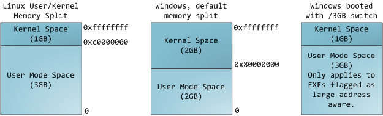

这并不意味着内核使用了那么多的物理内存，仅表示它可支配这么大的地址空间，可根据内核需要，将其映射到物理内存。内核空间在页表中拥有较高的特权级（ring 2或以下），因此只要用户态的程序试图访问这些页，就会导致一个页错误（page fault）。在Linux中，内核空间是持续存在的，并且在所有进程中都映射到同样的物理内存。内核代码和数据总是可寻址的，随时准备处理中断和系统调用。与此相反，用户模式地址空间的映射随进程切换的发生而不断变化：

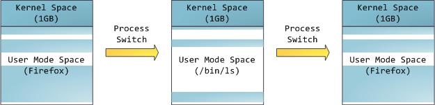

蓝色区域表示映射到物理内存的虚拟地址，而白色区域表示未映射的部分。在上面的例子中，Firefox使用了相当多的虚拟地址空间，因为它是传说中的吃内存大户。地址空间中的各个条带对应于不同的内存段（memory segment），如：堆、栈之类的。记住，这些段只是简单的内存地址范围，与Intel处理器的段没有关系。不管怎样，下面是一个Linux进程的标准的内存段布局：

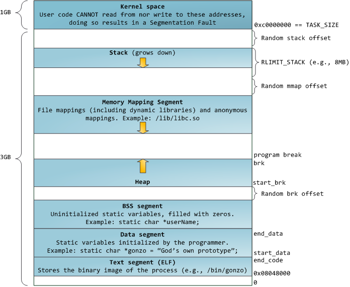

当计算机开心、安全、可爱、正常的运转时，几乎每一个进程的各个段的起始虚拟地址都与上图完全一致，这也给远程发掘程序安全漏洞打开了方便之门。一个发掘过程往往需要引用绝对内存地址：栈地址，库函数地址等。远程攻击者必须依赖地址空间布局的一致性，摸索着选择这些地址。如果让他们猜个正着，有人就会被整了。因此，地址空间的随机排布方式逐渐流行起来。Linux通过对栈、内存映射段、堆的起始地址加上随机的偏移量来打乱布局。不幸的是，32位地址空间相当紧凑，给随机化所留下的空当不大，削弱了这种技巧的效果。  

进程地址空间中最顶部的段是栈，大多数编程语言将之用于存储局部变量和函数参数。调用一个方法或函数会将一个新的栈桢（stack frame）压入栈中。栈桢在函数返回时被清理。也许是因为数据严格的遵从LIFO的顺序，这个简单的设计意味着不必使用复杂的数据结构来追踪栈的内容，只需要一个简单的指针指向栈的顶端即可。因此压栈（pushing）和退栈（popping）过程非常迅速、准确。另外，持续的重用栈空间有助于使活跃的栈内存保持在CPU缓存中，从而加速访问。进程中的每一个线程都有属于自己的栈。  
  
通过不断向栈中压入的数据，超出其容量就有会耗尽栈所对应的内存区域。这将触发一个页故障（page fault），并被Linux的expand_stack()处理，它会调用acct_stack_growth()来检查是否还有合适的地方用于栈的增长。如果栈的大小低于RLIMIT_STACK（通常是8MB），那么一般情况下栈会被加长，程序继续愉快的运行，感觉不到发生了什么事情。这是一种将栈扩展至所需大小的常规机制。然而，如果达到了最大的栈空间大小，就会栈溢出（stack overflow），程序收到一个段错误（Segmentation Fault）。当映射了的栈区域扩展到所需的大小后，它就不会再收缩回去，即使栈不那么满了。这就好比联邦预算，它总是在增长的。  
  
动态栈增长是唯一一种访问未映射内存区域（图中白色区域）而被允许的情形。其它任何对未映射内存区域的访问都会触发页故障，从而导致段错误。一些被映射的区域是只读的，因此企图写这些区域也会导致段错误。  
  
在栈的下方，是我们的内存映射段。此处，内核将文件的内容直接映射到内存。任何应用程序都可以通过Linux的mmap()系统调用（实现）或Windows的CreateFileMapping() / MapViewOfFile()请求这种映射。内存映射是一种方便高效的文件I/O方式，所以它被用于加载动态库。创建一个不对应于任何文件的匿名内存映射也是可能的，此方法用于存放程序的数据。在Linux中，如果你通过malloc()请求一大块内存，C运行库将会创建这样一个匿名映射而不是使用堆内存。‘大块’意味着比MMAP_THRESHOLD还大，缺省是128KB，可以通过mallopt()调整。  
  
说到堆，它是接下来的一块地址空间。与栈一样，堆用于运行时内存分配；但不同点是，堆用于存储那些生存期与函数调用无关的数据。大部分语言都提供了堆管理功能。因此，满足内存请求就成了语言运行时库及内核共同的任务。在C语言中，堆分配的接口是malloc()系列函数，而在具有垃圾收集功能的语言（如C#）中，此接口是new关键字。  
  
如果堆中有足够的空间来满足内存请求，它就可以被语言运行时库处理而不需要内核参与。否则，堆会被扩大，通过brk()系统调用（实现）来分配请求所需的内存块。堆管理是很复杂的，需要精细的算法，应付我们程序中杂乱的分配模式，优化速度和内存使用效率。处理一个堆请求所需的时间会大幅度的变动。实时系统通过特殊目的分配器来解决这个问题。堆也可能会变得零零碎碎，如下图所示：

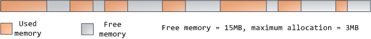

最后，我们来看看最底部的内存段：BSS，数据段，代码段。在C语言中，BSS和数据段保存的都是静态（全局）变量的内容。区别在于BSS保存的是未被初始化的静态变量内容，它们的值不是直接在程序的源代码中设定的。BSS内存区域是匿名的：它不映射到任何文件。如果你写static int cntActiveUsers，则cntActiveUsers的内容就会保存在BSS中。  
  
另一方面，数据段保存在源代码中已经初始化了的静态变量内容。这个内存区域不是匿名的。它映射了一部分的程序二进制镜像，也就是源代码中指定了初始值的静态变量。所以，如果你写static int cntWorkerBees = 10，则cntWorkerBees的内容就保存在数据段中了，而且初始值为10。尽管数据段映射了一个文件，但它是一个私有内存映射，这意味着更改此处的内存不会影响到被映射的文件。也必须如此，否则给全局变量赋值将会改动你硬盘上的二进制镜像，这是不可想象的。  
  
下图中数据段的例子更加复杂，因为它用了一个指针。在此情况下，指针gonzo（4字节内存地址）本身的值保存在数据段中。而它所指向的实际字符串则不在这里。这个字符串保存在代码段中，代码段是只读的，保存了你全部的代码外加零零碎碎的东西，比如字符串字面值。代码段将你的二进制文件也映射到了内存中，但对此区域的写操作都会使你的程序收到段错误。这有助于防范指针错误，虽然不像在C语言编程时就注意防范来得那么有效。下图展示了这些段以及我们例子中的变量：
    
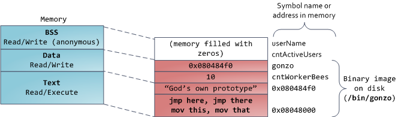

你可以通过阅读文件/proc/pid_of_process/maps来检验一个Linux进程中的内存区域。记住一个段可能包含许多区域。比如，每个内存映射文件在mmap段中都有属于自己的区域，动态库拥有类似BSS和数据段的额外区域。下一篇文章讲说明这些“区域”（area）的真正含义。有时人们提到“数据段”，指的就是全部的数据段 + BSS + 堆。  
  
你可以通过nm和objdump命令来察看二进制镜像，打印其中的符号，它们的地址，段等信息。最后需要指出的是，前文描述的虚拟地址布局在Linux中是一种“灵活布局”（flexible layout），而且以此作为默认方式已经有些年头了。它假设我们有值RLIMIT_STACK。当情况不是这样时，Linux退回使用“经典布局”（classic layout），如下图所示：

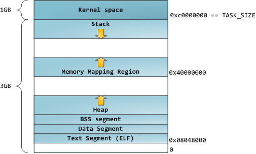

===
#linux用户进程内存空间详解
经常使用top命令了解进程信息，其中包括内存方面的信息。命令top帮助文档是这么解释各个字段的。

```
VIRT , Virtual Image (kb)
RES, Resident size (kb)
SHR, Shared Mem size (kb)
%MEM, Memory usage(kb)
SWAP, Swapped size (kb)
CODE, Code size (kb)
DATA, Data+Stack size (kb)
nFLT, Page Fault count
nDRT, Dirty Pages count
```
进程内存空间

```
正在运行的程序，叫进程。每个进程都有完全属于自己的，独立的，不被干扰的内存空间。此空间，被分成几个段(Segment),分别是Text, Data, BSS, Heap, Stack。用户进程内存空间，也是系统内核分配给该进程的VM(虚拟内存)，但并不表示这个进程占用了这么多的RAM(物理内存)。这个空间有多大？命令top输出的VIRT值告诉了我们各个进程内存空间的大小（进程内存空间随着程序的执行会增大或者缩小）。你还可以通过/proc//maps，或者pmap –d 了解某个进程内存空间都分布,比如:
[cpp] 
view plain
copy
1. #cat /proc/1449/maps  
2. …  
3. 0012e000-002a4000 r-xp 00000000 08:07 3539877    /lib/i386-linux-gnu/libc-2.13.so  
4. 002a4000-002a6000 r--p 00176000 08:07 3539877    /lib/i386-linux-gnu/libc-2.13.so  
5. 002a6000-002a7000 rw-p 00178000 08:07 3539877   /lib/i386-linux-gnu/libc-2.13.so  
6. 002a7000-002aa000 rw-p 00000000 00:00 0  
7. …  
8. 08048000-0875b000 r-xp 00000000 08:07 4072287    /usr/local/mysql/libexec/mysqld  
9. 0875b000-0875d000 r--p 00712000 08:07 4072287    /usr/local/mysql/libexec/mysqld  
10. 0875d000-087aa000 rw-p 00714000 08:07 4072287   /usr/local/mysql/libexec/mysqld  
11. …  
12. PS:线性地址，访问权限, offset, 设备号，inode，映射文件 
```
 
VM分配与释放

“内存总是被进程占用”，这句话换过来可以这么理解：进程总是需要内存。当fork()或者exec()一个进程的时候，系统内核就会分配一定量的VM给进程，作为进程的内存空间，大小由BSS段，Data段的已定义的全局变量、静态变量、Text段中的字符直接量、程序本身的内存映像等，还有Stack段的局部变量决定。当然，还可以通过malloc()等函数动态分配内存,向上扩大heap。  
  
动态分配与静态分配，二者最大的区别在于:1. 直到Run-Time的时候，执行动态分配，而在compile-time的时候，就已经决定好了分配多少Text+Data+BSS+Stack。2.通过malloc()动态分配的内存，需要程序员手工调用free()释放内存，否则容易导致内存泄露，而静态分配的内存则在进程执行结束后系统释放(Text, Data), 但Stack段中的数据很短暂，函数退出立即被销毁。  
  
我们使用几个示例小程序，加深理解

```
 /* @filename: example-2.c */  
 #include <stdio.h>  
    
 int main(int argc, char *argv[])  
 {  
     char arr[] = "hello world"; /* Stack段，rw--- */  
     char *p = "hello world";        /* Text段，字符串直接量, r-x--  */  
     arr[1] = 'l';  
     *(++p) = 'l';   /* 出错了,Text段不能write */  
     return 0;  
 }
``` 


<span style="font-size:18px;"><strong>PS<span class="sy0">:</span>变量p，它在Stack段，但它所指的”hello world”是一个字符串直接量，放在Text段。</strong></span>


```
/* @filename:example_2_2.c */  
 #include <stdio.h>  
 #include <stdlib.h>  
 #include <string.h>  
    
 char *get_str_1()  
 {  
     char str[] = "hello world";  
     return str;  
 }  
    
 char *get_str_2()  
 {  
     char *str = "hello world";  
     return str;  
 }  
    
 char *get_str_3()  
 {  
     char tmp[] = "hello world";  
     char *str;  
     str = (char *)malloc(12 * sizeof(char));  
     memcpy(str, tmp, 12);  
     return str;  
 }  
    
 int main(int argc, char *argv[])  
 {  
     char *str_1 = get_str_1();  //出错了，Stack段中的数据在函数退出时就销毁了  
     char *str_2 = get_str_2();  //正确，指向Text段中的字符直接量，退出程序后才会回收  
     char *str_3 = get_str_3();  //正确，指向Heap段中的数据，还没free()  
     printf("%s\n", str_1);  
     printf("%s\n", str_2);  
     printf("%s\n", str_3);  
     if (str_3 != NULL)  
     {  
         free(str_3);  
         str_3 = NULL;  
     }  
     return 0;  
 } 
 PS:使用malloc()，特别要留意heap段中的内存不用时，尽早手工free()。通过top输出的VIRT和RES两值来观察进程占用VM和RAM大小。
``` 

<span style="font-size:18px;"><strong>PS<span class="sy0">:</span>函数get_str_1<span class="br0" style="color:#66cc66;">(</span><span class="br0" style="color:#66cc66;">)</span>返回Stack段数据，编译时会报错。Heap中的数据，如果不用了，应该尽早释放free<span class="br0" style="color:#66cc66;">(</span><span class="br0" style="color:#66cc66;">)</span>。</strong></span>


```
65. #include <stdio.h>  
66. #include <stdlib.h>  
67. #include <string.h>  
68. #include <unistd.h>  
69.    
70. char data_var  = '1';  
71. char *mem_killer()  
72. {  
73.    char *p;  
74.    p = (char *)malloc(1024*1024*4);  
75.    memset(p, '\0', 1024*1024*4);  
76.    p = &data_var;   //危险，内存泄露  
77.    return p;  
78. }  
80. int main(int argc, char *argv[])  
81. {  
82.     char *p;  
83.     for (;;)  
84.     {  
85.         p = mem_killer(); // 函数中malloc()分配的内存没办法free()  
86.         printf("%c\n", *p);  
87.         sleep(20);  
88.     }  
89.     return 0;  
90. } 
```
 
<span style="font-size:18px;"><strong>PS<span class="sy0">:</span>使用malloc<span class="br0" style="color:#66cc66;">(</span><span class="br0" style="color:#66cc66;">)</span>，特别要留意heap段中的内存不用时，尽早手工free<span class="br0" style="color:#66cc66;">(</span><span class="br0" style="color:#66cc66;">)</span>。通过top输出的VIRT和RES两值来观察进程占用VM和RAM大小。</strong></span>

本节结束之前，介绍工具size。因为Text, BSS, Data段在编译时已经决定了进程将占用多少VM。可以通过size，知道这些信息。

```
91. # gcc example_2_3.c -o example_2_3  
92. # size example_2_3  
93. text     data    bss    dec hex filename  
94. 1403    272  8  1683    693 example_2_3  
```


##malloc()
编码人员在编写程序之际，时常要处理变化数据，无法预料要处理的数据集变化是否大（phper可能难以理解），所以除了变量之外，还需要动态分配内存。GNU libc库提供了二个内存分配函数,分别是malloc()和calloc()。调用malloc(size_t size)函数分配内存成功，总会分配size字节VM（再次强调不是RAM），并返回一个指向刚才所分配内存区域的开端地址。分配的内存会为进程一直保留着，直到你显示地调用free()释放它（当然，整个进程结束，静态和动态分配的内存都会被系统回收）。开发人员有责任尽早将动态分配的内存释放回系统。记住一句话:尽早free()！  
我们来看看，malloc()小示例。

```
95. /* @filename:example_2_4.c */  
96. #include <stdio.h>  
97. #include <stdlib.h>  
98.    
99. int main(int argc, char *argv[])  
100. {  
101.     char *p_4kb, *p_128kb, *p_300kb;  
102.     if ((p_4kb = malloc(4*1024)) != NULL)  
103.     {  
104.         free(p_4kb);  
105.     }  
106.     if ((p_128kb = malloc(128*1024)) != NULL)  
107.     {  
108.         free(p_128kb);  
109.     }  
110.     if ((p_300kb = malloc(300*1024)) != NULL)  
111.     {  
112.         free(p_300kb);  
113.     }  
114.     return 0;  
115. }  
```

```
116. #gcc example_2_4.c –o example_2_4  
117. #strace –t ./example_2_4  
118. …  
119. 00:02:53 brk(0)                         = 0x8f58000  
120. 00:02:53 brk(0x8f7a000)                 = 0x8f7a000  
121. 00:02:53 brk(0x8f79000)                 = 0x8f79000  
122. 00:02:53 mmap2(NULL, 311296, PROT_READ|PROT_WRITE, MAP_PRIVATE|MAP_ANONYMOUS, -1, 0) = 0xb772d000  
123. 00:02:53 munmap(0xb772d000, 311296)     = 0  
124. …  
```
<span style="font-size:18px;"><strong>PS<span class="sy0">:</span>系统调用brk<span class="br0" style="color:#66cc66;">(</span><span class="nu0" style="color:#ff33ff;">0</span><span class="br0" style="color:#66cc66;">)</span>取得当前堆的地址，也称为断点。</strong></span>


通过跟踪系统内核调用，可见glibc函数malloc()总是通过brk()或mmap()系统调用来满足内存分配需求。函数malloc()，根据不同大小内存要求来选择brk()，还是mmap()， 128Kbytes是临界值。小块内存(<=128kbytes)，会调用brk()，它将数据段的最高地址往更高处推（堆从底部向上增长）。大块内存，则使用mmap()进行匿名映射(设置标志MAP_ANONYMOUS)来分配内存，与堆无关，在堆之外。这样做是有道理的，试想：如果大块内存，也调用brk()，则容易被小块内存钉住，必竟用大块内存不是很频繁;反过来，小块内存分配更为频繁得多，如果也使用mmap()，频繁的创建内存映射会导致更多的开销，还有一点就是，内存映射的大小要求必须是“页”（单位，内存页面大小，默认4Kbytes或8Kbytes）的倍数,如果只是为了”hello world”这样小数据就映射一“页”内存，那实在是太浪费了。  
  
跟malloc()一样，释放内存函数free()，也会根据内存大小，选择使用brk()将断点往低处回推，或者选择调用munmap()解除映射。有一点需要注意：并不是每次调用free()小块内存，都会马上调用brk()，即堆并不会在每次内存被释放后就被缩减，而是会被glibc保留给下次malloc()使用(必竟小块内存分配较为频繁)，直到glibc发现堆空闲大小显著大于内存分配所需数量时，则会调用brk()。但每次free()大块内存，都会调用munmap()解除映射。下面是二张malloc()小块内存和大块内存的示例图。  
  
示意图:函数malloc(100000)，小于128kbytes，往高处推(heap->)。留意紫圈标注  
  
示意图：函数malloc(1024\*1024)，大于128kbytes，在heap与stack之间。留意紫圈。PS:图中的Data Segment泛指BSS, Data, Heap。有些文档有说明：数据段有三个子区域，分别是BSS, Data, Heap。
缺页异常(Fault Page)  

每次调用malloc()，系统都只是给进程分配线性地址（VM），并没有随即分配页框(RAM)。系统尽量将分配页框的工作推迟到最后一刻—用到时缺页异常处理。这种页框按需延迟分配策略最大好处之一：充分有效地善用系统稀缺资源RAM。  
  
当指针引用的内存页没有驻留在RAM中，即在RAM找不到与之对应的页框，则会发生缺页异常(对进程来说是透明的)，内核便陷入缺页异常处理。发生缺页异常有几种情况：1.只分配了线性地址，并没有分配页框，常发生在第一次访问某内存页。2.已经分配了页框，但页框被回收，换出至磁盘(交换区)。3.引用的内存页，在进程空间之外，不属于该进程，可能已被free()。我们使用一段伪代码来大致了解缺页异常。

```

 /* @filename: example_2_5.c */  
 …  
 demo()  
 {  
     char *p;  
     //分配了100Kbytes线性地址  
     if ((p = malloc(1024*100)) != NULL)  // L0  
     {  
         *p = ‘t’;     // L1  
     … //过去了很长一段时间，不管系统忙否，长久不用的页框都有可能被回收  
     *p = ‘m’;      // L2  
     p[4096] = ‘p’;   // L3  
     …  
     free(p);  //L4  
     if (p == NULL)  
     {  
         *p = ‘l’; // L5  
     }  
     }  
 }  
 …  
```
L0，函数malloc()通过brk()给进程分配了100Kbytes的线性地址区域(VM).然而，系统并没有随即分配页框(RAM)。即此时，进程没有占用100Kbytes的物理内存。这也表明了，你时常在使用top的时候VIRT值增大，而RES值却不变的原因。  
  
L1，通过*p引用了100Kbytes的第一页(4Kbytes)。因为是第一次引用此页，在RAM中找不到与之相对应的页框。发生缺页异常（对于进程而言缺页异常是透明的），系统灵敏地捕获这一异常，进入缺页异常处理阶段：接下来，系统会分配一个页框(RAM)映射给它。我们把这种情况(被访问的页还没有被放在任何一个页框中，内核分配一新的页框并适当初始化来满足调用请求)，也称为Demand Paging。  
  
L2，过了很长一段时间，通过\*p再次引用100Kbytes的第一页。若系统在RAM找不到它映射的页框(可能交换至磁盘了)。发生缺页异常，并被系统捕获进入缺页异常处理。接下来，系统则会分配一页页框(RAM)，找到备份在磁盘的那“页”，并将它换入内存(其实因为换入操作比较昂贵，所以不总是只换入一页，而是预换入多页。这也表明某些文档说：”vmstat某时出现不少si并不能意味着物理内存不足”)。凡是类似这种会迫使进程去睡眠（很可能是由于当前磁盘数据填充至页框(RAM)所花的时间）,阻塞当前进程的缺页异常处理称为主缺页(major falut)，也称为大缺页(参见下图)。相反，不会阻塞进程的缺页，称为次缺页(minor fault)，也称为小缺面。  

L3，引用了100Kbytes的第二页。参见第一次访问100Kbytes第一页, Demand Paging。  
  
L4，释放了内存：线性地址区域被删除，页框也被释放。  
  
L5，再次通过*p引用内存页，已被free()了(用户进程本身并不知道)。发生缺页异常，缺面异常处理程序会检查出这个缺页不在进程内存空间之内。对待这种编程错误引起的缺页异常，系统会杀掉这个进程，并且报告著名的段错误(Segmentation fault)。  
  
主缺页异常处理过程示意图,参见Page Fault Handling[http://www.slideshare.net/guestb7dc8e/handling-page-fault]

##页框回收PFRA  
  
随着网络并发用户数量增多，进程数量越来越多(比如一般守护进程会fork()子进程来处理用户请求)，缺页异常也就更频繁，需要缓存更多的磁盘数据(参考下篇OS Page Cache)，RAM也就越来越紧少。为了保证有够用的页框供给缺页异常处理，Linux有一套自己的做法，称为PFRA。PFRA总会从用户态进内存程空间和页面缓存中，“窃取”页框满足供给。所谓”窃取”，指的是：将用户进程内存空间对应占用的页框中的数据swap out至磁盘(称为交换区)，或者将OS页面缓存中的内存页（还有用户进程mmap()的内存页）flush(同步fsync())至磁盘设备。PS:如果你观察到因为RAM不足导致系统病态式般慢，通常都是因为缺页异常处理，以及PFRA在”盗页”。我们从以下几个方面了解PFRA。  
  
候选页框：找出哪些页框是可以被回收？  
  
进程内存空间占用的页框，比如数据段中的页(Heap, Data)，还有在Heap与Stack之间的匿名映射页(比如由malloc()分配的大内存)。但不包括Stack段中的页。  
  
进程空间mmap()的内存页，有映射文件，非匿名映射。  
  
缓存在页面缓存中Buffer/Cache占用的页框。也称OS Page Cache。

页框回收策略：确定了要回收的页框，就要进一步确定先回收哪些候选页框

尽量先回收页面缓存中的Buffer/Cache。其次再回收内存空间占用的页框。

进程空间占用的页框，要是没有被锁定，都可以回收。所以，当某进程睡眠久了，占用的页框会逐渐地交换出去至交换区。

使收LRU置换算法，将那些久而未用的页框优先被回收。这种被放在LRU的unused链表的页，常被认为接下来也不太可能会被引用。

相对回收Buffer/Cache而言，回收进程内存页，昂贵很多。所以，Linux默认只有swap_tendency(交换倾向值)值不小于100时，才会选择换出进程占用的RES。其实交换倾向值描述的是：系统越忙，且RES都被进程占用了，Buffer/Cache只占了一点点的时候，才开始回收进程占用页框。PS:这正表明了，某些DBA提议将MySQL InnoDB服务器vm.swappiness值设置为0，以此让InnoDB Buffer Pool数据在RES呆得更久。

如果实在是没有页框可回收，PFRA使出最狠一招，杀掉一个用户态进程，并释放这些被占的页框。当然，这个被杀的进程不是胡乱选的，至少应该是占用较多页框，运行优选级低，且不是root用户的进程。

激活回收页框：什么时候会回收页框?

紧急回收。系统内核发现没有够用的页框分配，供给读文件和内存缺页处理的时候，系统内核开始”紧急回收页框”。唤醒pdflush内核线程，先将1024页脏页从页面缓存写回磁盘。然后开始回收32页框，若反复回收13次，还收不齐32页框，则发狠杀一个进程。

周期性回收。在紧急回收之前，PFRA还会唤醒内核线程kswapd。为了避免更多的“紧急回收”，当发现空闲页框数量低于设置的警告值时，内核线程kswapd就会被唤醒，回收页框。直到空闲的页框的数量达到设定的安全值。PS:当RES资源紧张的时候，你可以通过ps命令看到更多的kswapd线程被唤醒。

OOM。在高峰时期，RES高度紧张的时候，kswapd持续回收的页框供不应求，直到进入”紧急回收”，直到 OOM。

##Paging 和Swapping
这二个关键字在很多地方出现，译过来应该是Paging（调页），Swapping(交换)。PS:英语里面用得多的动词加上ing，就成了名词，比如building。咬文嚼字，实在是太难。看二图

Swapping的大部分时间花在数据传输上，交换的数据也越多，意味时间开销也随之增加。对于进程而言，这个过程是透明的。由于RAM资源不足，PFRA会将部分匿名页框的数据写入到交换区(swap area)，备份之，这个动作称为so(swap out)。等到发生内存缺页异常的时候，缺页异常处理程序会将交换区(磁盘)的页面又读回物理内存，这个动作称为si(swap in)。每次Swapping，都有可能不只是一页数据，不管是si，还是so。Swapping意味着磁盘操作，更新页表等操作，这些操作开销都不小，会阻塞用户态进程。所以，持续飚高的si/so意味着物理内存资源是性能瓶颈。  
  
Paging，前文我们有说过Demand Paging。通过线性地址找到物理地址，找到页框。这个过程，可以认为是Paging，对于进程来讲，也是透明的。Paging意味着产生缺页异常，也有可能是大缺页，也就意味着浪费更多的CPU时间片资源。  
  
总结

```
1.用户进程内存空间分为5段,Text, DATA, BSS, Heap, Stack。其中Text只读可执行，DATA全局变量和静态变量,Heap用完就尽早free()，Stack里面的数据是临时的，退出函数就没了。

2.glibc malloc()动态分配内存。使用brk()或者mmap()，128Kbytes是一个临界值。避免内存泄露，避免野指针。

3.内核会尽量延后Demand Paging。主缺页是昂贵的。

4.先回收Buffer/Cache占用的页框，然后程序占用的页框,使用LRU置换算法。调小vm.swappiness值可以减少Swapping,减少大缺页。

5.更少的Paging和Swapping

6.fork()继承父进程的地址空间，不过是只读，使用cow技术,fork()函数特殊在于它返回二次。
```

===

linux内存地址空间管理
Linux对于内存的管理涉及到非常多的方面，这篇文章首先从对进程虚拟地址空间的管理说起。(所依据的代码是2.6.32.60）
无论是内核线程还是用户进程，对于内核来说，无非都是task_struct这个数据结构的一个实例而已，task_struct被称为进程描述符（process descriptor),因为它记录了这个进程所有的context。其中有一个被称为'内存描述符‘（memory descriptor)的数据结构mm_struct，抽象并描述了Linux视角下管理进程地址空间的所有信息。
mm_struct定义在include/linux/mm_types.h中，其中的域抽象了进程的地址空间，如下图所示：

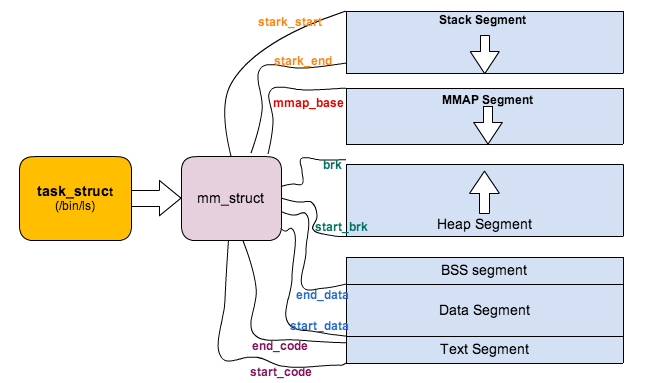
 
 
每个进程都有自己独立的mm_struct，使得每个进程都有一个抽象的平坦的独立的32或64位地址空间，各个进程都在各自的地址空间中相同的地址内存存放不同的数据而且互不干扰。如果进程之间共享相同的地址空间，则被称为线程。

```
其中[start_code,end_code)表示代码段的地址空间范围。
[start_data,end_start)表示数据段的地址空间范围。
[start_brk,brk)分别表示heap段的起始空间和当前的heap指针。
[start_stack,end_stack)表示stack段的地址空间范围。
```
mmap_base表示memory mapping段的起始地址。那为什么mmap段没有结束的地址呢？
bbs段是用来干什么的呢？bbs表示的所有没有初始化的全局变量，这样只需要将它们匿名映射为‘零页’，而不用在程序load过程中从磁盘文件显示的mapping，这样既减少了elf二进制文件的大小，也提高了程序加载的效率。在mm_struct中为什么没有bbs段的地址空间表示呢？
 
除此之外，mm_struct还定义了几个重要的域：

```
atomic_t mm_users; /* How many users with user space? */  
atomic_t mm_count; /* How many references to "struct mm_struct" (users count as 1) */
这两个counter乍看好像差不多，那Linux使用中有什么区别呢？看代码就是最好的解释了。
static int copy_mm(unsigned long clone_flags, struct task_struct * tsk)
{
	struct mm_struct * mm, *oldmm;
	int retval;
	tsk->mm = NULL;
	tsk->active_mm = NULL;
	/** Are we cloning a kernel thread?
	*We need to steal a active VM for that..
	*/
	oldmm = current->mm;
	if (!oldmm)
	return 0;
	if (clone_flags & CLONE_VM) {
	atomic_inc(&oldmm->mm_users);
	mm = oldmm;
	goto good_mm;
}
```

无论我们在调用fork,vfork,clone的时候最终会调用do_fork函数，区别在于vfork和clone会给copy_mm传入一个CLONE_VM的flag，这个标识表示父子进程都运行在同样一个‘虚拟地址空间’上面（在Linux称之为lightweight process或者线程），当然也就共享同样的物理地址空间（Page Frames)。

copy_mm函数中，如果创建线程中有CLONE_VM标识，则表示父子进程共享地址空间和同一个内存描述符，并且只需要将mm_users值+1，也就是说mm_users表示正在引用该地址空间的thread数目，是一个thread level的counter。

mm_count呢？mm_count的理解有点复杂。

对Linux来说，用户进程和内核线程（kernel thread)都是task_struct的实例，唯一的区别是kernel thread是没有进程地址空间的，内核线程也没有mm描述符的，所以内核线程的tsk->mm域是空（NULL）。内核scheduler在进程context switching的时候，会根据tsk->mm判断即将调度的进程是用户进程还是内核线程。但是虽然thread thread不用访问用户进程地址空间，但是仍然需要page table来访问kernel自己的空间。但是幸运的是，对于任何用户进程来说，他们的内核空间都是100%相同的，所以内核可以’borrow'上一个被调用的用户进程的mm中的页表来访问内核地址，这个mm就记录在active_mm。

简而言之就是，对于kernel thread,tsk->mm == NULL表示自己内核线程的身份，而tsk->active_mm是借用上一个用户进程的mm，用mm的page table来访问内核空间。对于用户进程，tsk->mm == tsk->active_mm。

为了支持这个特别，mm_struct里面引入了另外一个counter，mm_count。刚才说过mm_users表示这个进程地址空间被多少线程共享或者引用，而mm_count则表示这个地址空间被内核线程引用的次数+1。
比如一个进程A有3个线程，那么这个A的mm_struct的mm_users值为3，但是mm_count为1，所以mm_count是process level的counter。维护2个counter有何用处呢？考虑这样的scenario，内核调度完A以后，切换到内核内核线程B，B ’borrow' A的mm描述符以访问内核空间，这时mm_count变成了2，同时另外一个cpu core调度了A并且进程A exit，这个时候mm_users变为了0，mm_count变为了1，但是内核不会因为mm_users==0而销毁这个mm_struct，内核只会当mm_count==0的时候才会释放mm_struct，因为这个时候既没有用户进程使用这个地址空间，也没有内核线程引用这个地址空间。

```
static struct mm_struct * mm_init(struct mm_struct * mm, struct task_struct *p)
{
		atomic_set(&mm->mm_users, 1);
		atomic_set(&mm->mm_count, 1);
```

在初始化一个mm实例的时候，mm_users和mm_count都被初始化为1。

```
/* context_switch - switch to the new MM and the new996 * thread's register state.
*/
 static inline void (struct rq *rq, struct task_struct *prev,
 struct task_struct *next)
 struct mm_struct *mm, *oldmm;\3003
 prepare_task_switch(rq, prev, next);
 trace_sched_switch(rq, prev, next);
 mm = next->mm;
 oldmm = prev->active_mm;
 if (unlikely(!mm)) {
         next->active_mm = oldmm;
         atomic_inc(&oldmm->mm_count);
         enter_lazy_tlb(oldmm, next);
 } else
         switch_mm(oldmm, mm, next);
```
上面的代码是Linux scheduler进行的context switch的一小段，从unlike(!mm)开始，next->active_mm = oldmm表示如果将要切换倒内核线程，则‘借用’前一个拥护进程的mm描述符，并把他赋给active_mm，重点是将‘借用’的mm描述符的mm_counter加1。
下面我们看看在fork一个进程的时候，是怎样处理的mm_struct的。

```
/*
*  Ok, this is the main fork-routine.
*
* It copies the process, and if successful kick-starts
* it and waits for it to finish using the VM if required.
*/
do_fork(unsigned long clone_flags,
unsigned long stack_start,
struct pt_regs *regs,
unsigned long stack_size,
int __user *parent_tidptr,
int __user child_tidptr){
p = copy_process(clone_flags, stack_start, regs, stack_size,
child_tidptr, NULL, trace);
do_fork调用copy_process。
/*
* This creates a new process as a copy of the old one,
* but does not actually start it yet.
* It copies the registers, and all the appropriate
* parts of the process environment (as per the clone
* flags). The actual kick-off is left to the caller.
*/
struct task_struct *copy_process(unsigned long clone_flags,
unsigned long stack_start,
struct pt_regs *regs,
unsigned long stack_size,
int __user *child_tidptr,
struct pid *pid,
int trace)
{
if ((retval = copy_mm(clone_flags, p)))
goto bad_fork_cleanup_signal;
```
copy_process调用copy_mm，下面来分析copy_mm。

```
int copy_mm(unsigned long clone_flags, struct task_struct * tsk)
{
	struct mm_struct * mm, *oldmm;
        int retval;

        tsk->min_flt = tsk->maj_flt = 0;
        tsk->nvcsw = tsk->nivcsw = 0;
	#ifdef CONFIG_DETECT_HUNG_TASK
        tsk->last_switch_count = tsk->nvcsw + tsk->nivcsw;
		#endif

        tsk->mm = NULL;
        tsk->active_mm = NULL;

        /*
         * Are we cloning a kernel thread?
         *
         * We need to steal a active VM for that..
         */
        oldmm = current->mm;
        if (!oldmm)
                return 0;

        if (clone_flags & CLONE_VM) {
                atomic_inc(&oldmm->mm_users);
                mm = oldmm;
                goto good_mm;
        }

        retval = -ENOMEM;
        mm = dup_mm(tsk);
        if (!mm)
                goto fail_nomem;
	good_mm:
        /* Initializing for Swap token stuff */
        mm->token_priority = 0;
        mm->last_interval = 0;

        tsk->mm = mm;
        tsk->active_mm = mm;
        return 0;

	fail_nomem:
        return retval;
}
```
692，693行，对子进程或者线程的mm和active_mm初始化（NULL）。
700 - 708行，就是我们上面说的如果是创建线程，则新线程共享创建进程的mm，所以不需要进行下面的copy操作。
重点就是711行的dup_mm(tsk)。

```
/*
 * Allocate a new mm structure and copy contents from the
 * mm structure of the passed in task structure.
 */
struct mm_struct *dup_mm(struct task_struct *tsk)
{
        struct mm_struct *mm, *oldmm = current->mm;
        int err;
        if (!oldmm)
                return NULL;
        mm = allocate_mm();
        if (!mm)
                goto fail_nomem;
        memcpy(mm, oldmm, sizeof(*mm));
        /* Initializing for Swap token stuff */
        mm->token_priority = 0;
        mm->last_interval = 0;
        if (!mm_init(mm, tsk))
                goto fail_nomem;
        if (init_new_context(tsk, mm))
                goto fail_nocontext;
        dup_mm_exe_file(oldmm, mm);
        err = dup_mmap(mm, oldmm);
        if (err)
                goto free_pt;
        mm->hiwater_rss = get_mm_rss(mm);
        mm->hiwater_vm = mm->total_vm;
        if (mm->binfmt && !try_module_get(mm->binfmt->module))
                goto free_pt;
        return mm;
```
633行，用slab分配了mm_struct的内存对象。
637行，对子进程的mm_struct进程赋值，使其等于父进程，这样子进程mm和父进程mm的每一个域的值都相同。
在copy_mm的实现中，主要是为了实现unix COW的语义，所以理论上我们只需要父子进程mm中的start_x和end_x之类的域（像start_data,end_data)相等，而对其余的域（像mm_users)则需要re-init，这个操作主要在mm_init中完成。


```
static struct mm_struct * mm_init(struct mm_struct * mm, struct task_struct *p)  
{			
			atomic_set(&mm->mm_users, 1);
			        atomic_set(&mm->mm_count, 1);
			        init_rwsem(&mm->mmap_sem);
			        INIT_LIST_HEAD(&mm->mmlist);
			        mm->flags = (current->mm) ?
			                (current->mm->flags & MMF_INIT_MASK) : default_dump_filter;
			        mm->core_state = NULL;
			        mm->nr_ptes = 0;
			        set_mm_counter(mm, file_rss, 0);
			        set_mm_counter(mm, anon_rss, 0);
			        spin_lock_init(&mm->page_table_lock);
			        mm->free_area_cache = TASK_UNMAPPED_BASE;
			        mm->cached_hole_size = ~0UL;
			        mm_init_aio(mm);
			        mm_init_owner(mm, p);		
			        if (likely(!mm_alloc_pgd(mm))) {
			                mm->def_flags = 0;
			                mmu_notifier_mm_init(mm);
			                return mm;
			        }			
			        free_mm(mm);
			        return NULL;
			}
```

其中特别要关注的是467 - 471行的mm_alloc_pdg，也就是page table的拷贝,page table负责logic address到physical address的转换。
拷贝的结果就是父子进程有独立的page table，但是page table里面的每个entries值都是相同的，也就是说父子进程独立地址空间中相同logical address都对应于相同的physical address，这样也就是实现了父子进程的COW(copy on write)语义。
事实上，vfork和fork相比，最大的开销节省就是对page table的拷贝。
而在内核2.6中，由于page table的拷贝，fork在性能上是有所损耗的，所以内核社区里面讨论过shared page table的实现（http://lwn.net/Articles/149888/）。

===

##6.C风格的内存分配程序
<span id="6"></span>

简化实现的代码，来帮助说明管理内存时都涉及到了哪些事情。

[malloc.c](./src/malloc.c)

###基于 UNIX 的系统有两个可映射到附加内存中的基本系统调用：

```
brk：brk() 是一个非常简单的系统调用。 还记得系统中断点吗？该位置是进程映射的内存边界。 brk() 只是简单地 将这个位置向前或者向后移动，就可以向进程添加内存或者从进程取走内存。
mmap：mmap()，或者说是“内存映像”，类似于 brk()，但是更为灵活。首先，它可以映射任何位置的内存， 而不单单只局限于进程。其次，它不仅可以将虚拟地址映射到物理的 RAM 或者 swap，它还可以将 它们映射到文件和文件位置，这样，读写内存将对文件中的数据进行读写。不过，在这里，我们只关心 mmap 向进程添加被映射的内存的能力。 munmap() 所做的事情与 mmap() 相反。
如您所见， brk() 或者 mmap() 都可以用来向我们的 进程添加额外的虚拟内存。在我们的例子中将使用 brk()，因为它更简单，更通用。
```

###6.1实现一个简单的分配程序
<span id="6.1"></span>
如果您曾经编写过很多 C 程序，那么您可能曾多次使用过 malloc() 和 free()。不过，您可能没有用一些时间去思考它们在您的操作系统中 是如何实现的。本节将向您展示 malloc 和 free 的 一个最简化实现的代码，来帮助说明管理内存时都涉及到了哪些事情。
要试着运行这些示例，需要先 复制本代码清单，并将其粘贴到一个名为 malloc.c 的文件中。接下来，我将一次一个部分地对该清单进行解释。
在大部分操作系统中，内存分配由以下两个简单的函数来处理：

```
void *malloc(long numbytes)：该函数负责分配 numbytes 大小的内存，并返回指向第一个字节的指针。
void free(void *firstbyte)：如果给定一个由先前的 malloc 返回的指针，那么该函数会将分配的空间归还给进程的“空闲空间”。
malloc_init 将是初始化内存分配程序的函数。它要完成以下三件事： 将分配程序标识为已经初始化，找到系统中最后一个有效内存地址，然后建立起指向我们管理 的内存的指针。这三个变量都是全局变量：
```
####清单 1. 我们的简单分配程序的全局变量

```
int has_initialized = 0;
void *managed_memory_start;
void *last_valid_address;
```
如前所述，被映射的内存的边界（最后一个有效地址）常被称为系统中断点或者 当前中断点。 在很多 UNIX® 系统中，为了指出当前系统中断点，必须使用 sbrk(0) 函数。 sbrk 根据参数中给出的字节数移动当前系统中断点，然后返回新的系统中断点。 使用参数 0 只是返回当前中断点。这里是我们的 malloc 初始化代码，它将找到当前中断点并初始化我们的变量：
####清单 2. 分配程序初始化函数

```
/* Include the sbrk function */
#include <unistd.h>
void malloc_init()
{
	/* grab the last valid address from the OS */
	last_valid_address = sbrk(0);
	/* we don't have any memory to manage yet, so
	 *just set the beginning to be last_valid_address
	 */
	managed_memory_start = last_valid_address;
	/* Okay, we're initialized and ready to go */
 	has_initialized = 1;
}
```
现在，为了完全地管理内存，我们需要能够追踪要分配和回收哪些内存。在对内存块进行了 free 调用之后，我们需要做的是诸如将它们标记为未被使用的等事情，并且，在调用 malloc 时， 我们要能够定位未被使用的内存块。因此， malloc 返回的每块内存的起始处首先要有这个 结构：

####清单 3. 内存控制块结构定义

```
struct mem_control_block {
	int is_available;
	int size;
};
```
现在，您可能会认为当程序调用 malloc 时这会引发问题 —— 它们如何知道这个结构？ 答案是它们不必知道；在返回指针之前，我们会将其移动到这个结构之后，把它隐藏起来。这使得返回的指针 指向没有用于任何其他用途的内存。那样，从调用程序的角度来看，它们所得到的全部是空闲的、开放的内存。然后，当通过 free() 将该指针传递回来时，我们只需要倒退几个内存字节就可以再次找到这个结构。
在讨论分配内存之前，我们将先讨论释放，因为它更简单。为了释放内存，我们必须要做的惟一一件事情就是， 获得我们给出的指针，回退 sizeof(struct mem_control_block) 个字节，并将其 标记为可用的。这里是对应的代码：
####清单 4. 解除分配函数

```
void free(void *firstbyte) {
	struct mem_control_block *mcb;
	/* Backup from the given pointer to find the
	 * mem_control_block
	 */
	mcb = firstbyte - sizeof(struct mem_control_block);
	/* Mark the block as being available */
	mcb->is_available = 1;
	/* That's It!  We're done. */
	return;
}
```
如您所见，在这个分配程序中，内存的释放使用了一个非常简单的机制，在固定时间内完成内存释放。 分配内存稍微困难一些。以下是该算法的略述：
####清单 5. 主分配程序的伪代码

```
1. If our allocator has not been initialized, initialize it.
2. Add sizeof(struct mem_control_block) to the size requested.
3. start at managed_memory_start.
4. Are we at last_valid address?
5. If we are:
   A. We didn't find any existing space that was large enough
      -- ask the operating system for more and return that.
6. Otherwise:
   A. Is the current space available (check is_available from
      the mem_control_block)?
   B. If it is:
      i)   Is it large enough (check "size" from the
           mem_control_block)?
      ii)  If so:
           a. Mark it as unavailable
           b. Move past mem_control_block and return the
              pointer
      iii) Otherwise:
           a. Move forward "size" bytes
           b. Go back go step 4
   C. Otherwise:
      i)   Move forward "size" bytes
      ii)  Go back to step 4
```
我们主要使用连接的指针遍历内存来寻找开放的内存块。这里是代码：
####清单 6. 主分配程序

```
void *malloc(long numbytes) {
	/* Holds where we are looking in memory */
	void *current_location;
	/* This is the same as current_location, but cast to a
	 * memory_control_block
	 */
	struct mem_control_block *current_location_mcb;
	/* This is the memory location we will return.  It will
	 * be set to 0 until we find something suitable
	 */
	void *memory_location;
	/* Initialize if we haven't already done so */
	if(! has_initialized) 	{
		malloc_init();
	}
	/* The memory we search for has to include the memory
	 * control block, but the users of malloc don't need
	 * to know this, so we'll just add it in for them.
	 */
	numbytes = numbytes + sizeof(struct mem_control_block);
	/* Set memory_location to 0 until we find a suitable
	 * location
	 */
	memory_location = 0;
	/* Begin searching at the start of managed memory */
	current_location = managed_memory_start;
	/* Keep going until we have searched all allocated space */
	while(current_location != last_valid_address)
	{
		/* current_location and current_location_mcb point
		 * to the same address.  However, current_location_mcb
		 * is of the correct type, so we can use it as a struct.
		 * current_location is a void pointer so we can use it
		 * to calculate addresses.
		 */
		current_location_mcb =
			(struct mem_control_block *)current_location;
		if(current_location_mcb->is_available)
		{
			if(current_location_mcb->size >= numbytes)
			{
				/* Woohoo!  We've found an open,
				 * appropriately-size location.
				 */
				/* It is no longer available */
				current_location_mcb->is_available = 0;
				/* We own it */
				memory_location = current_location;
				/* Leave the loop */
				break;
			}
		}
		/* If we made it here, it's because the Current memory
		 * block not suitable; move to the next one
		 */
		current_location = current_location +
			current_location_mcb->size;
	}
	/* If we still don't have a valid location, we'll
	 * have to ask the operating system for more memory
	 */
	if(! memory_location)
	{
		/* Move the program break numbytes further */
		sbrk(numbytes);
		/* The new memory will be where the last valid
		 * address left off
		 */
		memory_location = last_valid_address;
		/* We'll move the last valid address forward
		 * numbytes
		 */
		last_valid_address = last_valid_address + numbytes;
		/* We need to initialize the mem_control_block */
		current_location_mcb = memory_location;
		current_location_mcb->is_available = 0;
		current_location_mcb->size = numbytes;
	}
	/* Now, no matter what (well, except for error conditions),
	 * memory_location has the address of the memory, including
	 * the mem_control_block
	 */
	/* Move the pointer past the mem_control_block */
	memory_location = memory_location + sizeof(struct mem_control_block);
	/* Return the pointer */
	return memory_location;
 }
```
这就是我们的内存管理器。现在，我们只需要构建它，并在程序中使用它即可。
运行下面的命令来构建 malloc 兼容的分配程序（实际上，我们忽略了 realloc() 等一些函数，不过， malloc() 和 free() 才是最主要的函数）：
####清单 7. 编译分配程序

```
gcc -shared -fpic malloc.c -o malloc.so
```
该程序将生成一个名为 malloc.so 的文件，它是一个包含有我们的代码的共享库。
在 UNIX 系统中，现在您可以用您的分配程序来取代系统的 malloc()， 做法如下：
####清单 8. 替换您的标准的 malloc

```
LD_PRELOAD=/path/to/malloc.so
export LD_PRELOAD
```
LD_PRELOAD 环境变量使动态链接器在加载任何可执行程序之前，先加载给定的共享库 的符号。它还为特定库中的符号赋予优先权。因此，从现在起，该会话中的任何应用程序都将使用我们的 malloc()，而不是只有系统的应用程序能够使用。有一些应用程序不使用 malloc()， 不过它们是例外。其他使用 realloc() 等其他内存管理函数的应用程序，或者 错误地假定 malloc() 内部行为的那些应用程序，很可能会崩溃。ash shell 似乎可以 使用我们的新 malloc() 很好地工作。
如果您想确保 malloc() 正在被使用，那么您应该通过向函数的入口点添加 write() 调用来进行测试。

我们的内存管理器在很多方面都还存在欠缺，但它可以有效地展示内存管理需要做什么事情。它的某些缺点包括：

由于它对系统中断点（一个全局变量）进行操作，所以它不能与其他分配程序或者 mmap 一起使用。

当分配内存时，在最坏的情形下，它将不得不遍历 全部进程内存；其中可能包括位于硬盘上的很多内存， 这意味着操作系统将不得不花时间去向硬盘移入数据和从硬盘中移出数据。

没有很好的内存不足处理方案（ malloc 只假定内存分配是成功的）。

它没有实现很多其他的内存函数，比如 realloc()。

由于 sbrk() 可能会交回比我们请求的更多的内存，所以在堆（heap）的末端 会遗漏一些内存。

虽然 is_available 标记只包含一位信息，但它要使用完整的 4-字节 的字。

分配程序不是线程安全的。

分配程序不能将空闲空间拼合为更大的内存块。

分配程序的过于简单的匹配算法会导致产生很多潜在的内存碎片。

我确信还有很多其他问题。这就是为什么它只是一个例子!

其他 malloc 实现
malloc() 的实现有很多，这些实现各有优点与缺点。在设计一个分配程序时， 要面临许多需要折衷的选择，其中包括：

```
分配的速度。
回收的速度。
有线程的环境的行为。
内存将要被用光时的行为。
局部缓存。
簿记（Bookkeeping）内存开销。
虚拟内存环境中的行为。
小的或者大的对象。
实时保证。
```

###基于 malloc() 的内存管理的缺点

```
不只是我们的内存管理器有缺点，基于 malloc() 的内存管理器仍然也有很多缺点，不管您使用的是哪个分配程序。对于那些需要保持长期存储的程序使用 malloc() 来管理内存可能会非常令人失望。如果您有大量的不固定的内存引用，经常难以知道它们何时被释放。生存期局限于当前函数的内存非常容易管理，但是对于生存期超出该范围的内存来说，管理内存则困难得多。而且，关于内存管理是由进行调用的 程序还是由被调用的函数来负责这一问题，很多 API 都不是很明确。
```

##6.2半自动内存管理策略
<span id="6.2"></span>
###引用计数
引用计数是一种 半自动（semi-automated）的内存管理技术，这表示它需要一些编程支持，但是它不需要您确切知道某一对象何时不再被使用。引用计数机制为您完成内存管理任务。

在引用计数中，所有共享的数据结构都有一个域来包含当前活动“引用”结构的次数。当向一个程序传递一个指向某个数据结构指针时，该程序会将引用计数增加 1。实质上，您是在告诉数据结构，它正在被存储在多少个位置上。然后，当您的进程完成对它的使用后，该程序就会将引用计数减少 1。结束这个动作之后，它还会检查计数是否已经减到零。如果是，那么它将释放内存。

这样做的好处是，您不必追踪程序中某个给定的数据结构可能会遵循的每一条路径。每次对其局部的引用，都将导致计数的适当增加或减少。这样可以防止在使用数据结构时释放该结构。不过，当您使用某个采用引用计数的数据结构时，您必须记得运行引用计数函数。另外，内置函数和第三方的库不会知道或者可以使用您的引用计数机制。引用计数也难以处理发生循环引用的数据结构。

要实现引用计数，您只需要两个函数 —— 一个增加引用计数，一个减少引用计数并当计数减少到零时释放内存。

一个示例引用计数函数集可能看起来如下所示：
####清单 9. 基本的引用计数函数

```
/* Structure Definitions*/
/* Base structure that holds a refcount */
struct refcountedstruct
{
	int refcount;
}
/* All refcounted structures must mirror struct
 * refcountedstruct for their first variables
 */
/* Refcount maintenance functions */
/* Increase reference count */
void REF(void *data)
{
	struct refcountedstruct *rstruct;
	rstruct = (struct refcountedstruct *) data;
	rstruct->refcount++;
}
/* Decrease reference count */
void UNREF(void *data)
{
	struct refcountedstruct *rstruct;
	rstruct = (struct refcountedstruct *) data;
	rstruct->refcount--;
	/* Free the structure if there are no more users */
	if(rstruct->refcount == 0)
	{
		free(rstruct);
	}
}
```
REF 和 UNREF 可能会更复杂，这取决于您想要做的事情。例如，您可能想要为多线程程序增加锁，那么您可能想扩展 refcountedstruct，使它同样包含一个指向某个在释放内存之前要调用的函数的指针（类似于面向对象语言中的析构函数 —— 如果您的结构中包含这些指针，那么这是 必需的）。
当使用 REF 和 UNREF 时，您需要遵守这些指针的分配规则：
UNREF 分配前左端指针（left-hand-side pointer）指向的值。
REF 分配后左端指针（left-hand-side pointer）指向的值。
在传递使用引用计数的结构的函数中，函数需要遵循以下这些规则：
在函数的起始处 REF 每一个指针。
在函数的结束处 UNREF 第一个指针。
以下是一个使用引用计数的生动的代码示例：
####清单 10. 使用引用计数的示例

```
/* EXAMPLES OF USAGE */
/* Data type to be refcounted */
struct mydata
{
	int refcount; /* same as refcountedstruct */
	int datafield1; /* Fields specific to this struct */
	int datafield2;
	/* other declarations would go here as appropriate */
};
/* Use the functions in code */
void dosomething(struct mydata *data)
{
	REF(data);
	/* Process data */
	/* when we are through */
	UNREF(data);
}
struct mydata *globalvar1;
/* Note that in this one, we don't decrease the
 * refcount since we are maintaining the reference
 * past the end of the function call through the
 * global variable
 */
void storesomething(struct mydata *data)
{
	REF(data); /* passed as a parameter */
	globalvar1 = data;
	REF(data); /* ref because of Assignment */
	UNREF(data); /* Function finished */
}
```

由于引用计数是如此简单，大部分程序员都自已去实现它，而不是使用库。不过，它们依赖于 malloc 和 free 等低层的分配程序来实际地分配和释放它们的内存。
在 Perl 等高级语言中，进行内存管理时使用引用计数非常广泛。在这些语言中，引用计数由语言自动地处理，所以您根本不必担心它，除非要编写扩展模块。由于所有内容都必须进行引用计数，所以这会对速度产生一些影响，但它极大地提高了编程的安全性和方便性。以下是引用计数的益处：
实现简单。
易于使用。
由于引用是数据结构的一部分，所以它有一个好的缓存位置。
不过，它也有其不足之处：
要求您永远不要忘记调用引用计数函数。
无法释放作为循环数据结构的一部分的结构。
减缓几乎每一个指针的分配。
尽管所使用的对象采用了引用计数，但是当使用异常处理（比如 try 或 setjmp()/ longjmp()） 时，您必须采取其他方法。
需要额外的内存来处理引用。
引用计数占用了结构中的第一个位置，在大部分机器中最快可以访问到的就是这个位置。
在多线程环境中更慢也更难以使用。
C++ 可以通过使用 智能指针（smart pointers）来容忍程序员所犯的一些错误，智能指针可以为您处理引用计数等指针处理细节。不过，如果不得不使用任何先前的不能处理智能指针的代码（比如对 C 库的联接），实际上，使用它们的后果通实比不使用它们更为困难和复杂。因此，它通常只是有益于纯 C++ 项目。如果您想使用智能指针，那么您实在应该去阅读 Alexandrescu 撰写的 Modern C++ Design 一书中的“Smart Pointers”那一章。
##内存池
内存池是另一种半自动内存管理方法。内存池帮助某些程序进行自动内存管理，这些程序会经历一些特定的阶段，而且每个阶段中都有分配给进程的特定阶段的内存。例如，很多网络服务器进程都会分配很多针对每个连接的内存 —— 内存的最大生存期限为当前连接的存在期。Apache 使用了池式内存（pooled memory），将其连接拆分为各个阶段，每个阶段都有自己的内存池。在结束每个阶段时，会一次释放所有内存。

在池式内存管理中，每次内存分配都会指定内存池，从中分配内存。每个内存池都有不同的生存期限。在 Apache 中，有一个持续时间为服务器存在期的内存池，还有一个持续时间为连接的存在期的内存池，以及一个持续时间为请求的存在期的池，另外还有其他一些内存池。因此，如果我的一系列函数不会生成比连接持续时间更长的数据，那么我就可以完全从连接池中分配内存，并知道在连接结束时，这些内存会被自动释放。另外，有一些实现允许注册 清除函数（cleanup functions），在清除内存池之前，恰好可以调用它，来完成在内存被清理前需要完成的其他所有任务（类似于面向对象中的析构函数）。

要在自己的程序中使用池，您既可以使用 GNU libc 的 obstack 实现，也可以使用 Apache 的 Apache Portable Runtime。GNU obstack 的好处在于，基于 GNU 的 Linux 发行版本中默认会包括它们。Apache Portable Runtime 的好处在于它有很多其他工具，可以处理编写多平台服务器软件所有方面的事情。要深入了解 GNU obstack 和 Apache 的池式内存实现，请参阅 参考资料部分中指向这些实现的文档的链接。

下面的假想代码列表展示了如何使用 obstack：

####清单 11. obstack 的示例代码

```
#include <obstack.h>
#include <stdlib.h>
/* Example code listing for using obstacks */
/* Used for obstack macros (xmalloc is
   a malloc function that exits if memory
   is exhausted */
#define obstack_chunk_alloc xmalloc
#define obstack_chunk_free free
/* Pools */
/* Only permanent allocations should go in this pool */
struct obstack *global_pool;
/* This pool is for per-connection data */
struct obstack *connection_pool;
/* This pool is for per-request data */
struct obstack *request_pool;
void allocation_failed()
{
	exit(1);
}
int main()
{
	/* Initialize Pools */
	global_pool = (struct obstack *)
		xmalloc (sizeof (struct obstack));
	obstack_init(global_pool);
	connection_pool = (struct obstack *)
		xmalloc (sizeof (struct obstack));
	obstack_init(connection_pool);
	request_pool = (struct obstack *)
		xmalloc (sizeof (struct obstack));
	obstack_init(request_pool);
	/* Set the error handling function */
	obstack_alloc_failed_handler = &allocation_failed;
	/* Server main loop */
	while(1)
	{
		wait_for_connection();
		/* We are in a connection */
		while(more_requests_available())
		{
			/* Handle request */
			handle_request();
			/* Free all of the memory allocated
			 * in the request pool
			 */
			obstack_free(request_pool, NULL);
		}
		/* We're finished with the connection, time
		 * to free that pool
		 */
		obstack_free(connection_pool, NULL);
	}
}
int handle_request()
{
	/* Be sure that all object allocations are allocated
	 * from the request pool
	 */
	int bytes_i_need = 400;
	void *data1 = obstack_alloc(request_pool, bytes_i_need);
	/* Do stuff to process the request */
	/* return */
	return 0;
}
```
基本上，在操作的每一个主要阶段结束之后，这个阶段的 obstack 会被释放。不过，要注意的是，如果一个过程需要分配持续时间比当前阶段更长的内存，那么它也可以使用更长期限的 obstack，比如连接或者全局内存。传递给 obstack_free() 的 NULL 指出它应该释放 obstack 的全部内容。可以用其他的值，但是它们通常不怎么实用。

使用池式内存分配的益处如下所示：

应用程序可以简单地管理内存。

内存分配和回收更快，因为每次都是在一个池中完成的。分配可以在 O(1) 时间内完成，释放内存池所需时间也差不多（实际上是 O(n) 时间，不过在大部分情况下会除以一个大的因数，使其变成 O(1)）。

可以预先分配错误处理池（Error-handling pools），以便程序在常规内存被耗尽时仍可以恢复。

有非常易于使用的标准实现。

池式内存的缺点是：

内存池只适用于操作可以分阶段的程序。

内存池通常不能与第三方库很好地合作。

如果程序的结构发生变化，则不得不修改内存池，这可能会导致内存管理系统的重新设计。

您必须记住需要从哪个池进行分配。另外，如果在这里出错，就很难捕获该内存池。

##6.3垃圾收集
<span id="6.3"></span>
垃圾收集（Garbage collection）是全自动地检测并移除不再使用的数据对象。垃圾收集器通常会在当可用内存减少到少于一个具体的阈值时运行。通常，它们以程序所知的可用的一组“基本”数据 —— 栈数据、全局变量、寄存器 —— 作为出发点。然后它们尝试去追踪通过这些数据连接到每一块数据。收集器找到的都是有用的数据；它没有找到的就是垃圾，可以被销毁并重新使用这些无用的数据。为了有效地管理内存，很多类型的垃圾收集器都需要知道数据结构内部指针的规划，所以，为了正确运行垃圾收集器，它们必须是语言本身的一部分。

###收集器的类型

```
复制（copying）： 这些收集器将内存存储器分为两部分，只允许数据驻留在其中一部分上。它们定时地从“基本”的元素开始将数据从一部分复制到另一部分。内存新近被占用的部分现在成为活动的，另一部分上的所有内容都认为是垃圾。另外，当进行这项复制操作时，所有指针都必须被更新为指向每个内存条目的新位置。因此，为使用这种垃圾收集方法，垃圾收集器必须与编程语言集成在一起。

标记并清理（Mark and sweep）：每一块数据都被加上一个标签。不定期的，所有标签都被设置为 0，收集器从“基本”的元素开始遍历数据。当它遇到内存时，就将标签标记为 1。最后没有被标记为 1 的所有内容都认为是垃圾，以后分配内存时会重新使用它们。

增量的（Incremental）：增量垃圾收集器不需要遍历全部数据对象。因为在收集期间的突然等待，也因为与访问所有当前数据相关的缓存问题（所有内容都不得不被页入（page-in）），遍历所有内存会引发问题。增量收集器避免了这些问题。

保守的（Conservative）：保守的垃圾收集器在管理内存时不需要知道与数据结构相关的任何信息。它们只查看所有数据类型，并假定它们 可以全部都是指针。所以，如果一个字节序列可以是一个指向一块被分配的内存的指针，那么收集器就将其标记为正在被引用。有时没有被引用的内存会被收集，这样会引发问题，例如，如果一个整数域中包含一个值，该值是已分配内存的地址。不过，这种情况极少发生，而且它只会浪费少量内存。保守的收集器的优势是，它们可以与任何编程语言相集成。

```
Hans Boehm 的保守垃圾收集器是可用的最流行的垃圾收集器之一，因为它是免费的，而且既是保守的又是增量的，可以使用 --enable-redirect-malloc 选项来构建它，并且可以将它用作系统分配程序的简易替代者（drop-in replacement）（用 malloc/ free 代替它自己的 API）。实际上，如果这样做，您就可以使用与我们在示例分配程序中所使用的相同的 LD_PRELOAD 技巧，在系统上的几乎任何程序中启用垃圾收集。如果您怀疑某个程序正在泄漏内存，那么您可以使用这个垃圾收集器来控制进程。在早期，当 Mozilla 严重地泄漏内存时，很多人在其中使用了这项技术。这种垃圾收集器既可以在 Windows® 下运行，也可以在 UNIX 下运行。
####垃圾收集的一些优点：

```
您永远不必担心内存的双重释放或者对象的生命周期。
使用某些收集器，您可以使用与常规分配相同的 API。
```
####其缺点包括：

```
使用大部分收集器时，您都无法干涉何时释放内存。
在多数情况下，垃圾收集比其他形式的内存管理更慢。
垃圾收集错误引发的缺陷难于调试。
如果您忘记将不再使用的指针设置为 null，那么仍然会有内存泄漏。
```
##6.4结束语
<span id="6.4"></span>

一切都需要折衷：性能、易用、易于实现、支持线程的能力等，这里只列出了其中的一些。为了满足项目的要求，有很多内存管理模式可以供您使用。每种模式都有大量的实现，各有其优缺点。对很多项目来说，使用编程环境默认的技术就足够了，不过，当您的项目有特殊的需要时，了解可用的选择将会有帮助。下表对比了本文中涉及的内存管理策略。
##表 1. 内存分配策略的对比


===


##七.tcmalloc

[tcmalloc](http://dirlt.com/tcmalloc.html)

